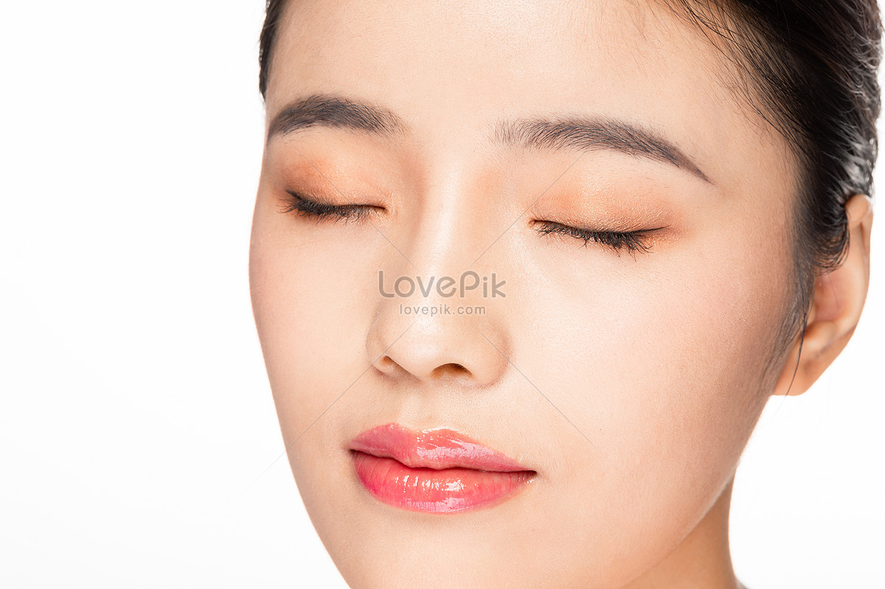

label: [x_min, y_min] [x_max, y_max]

closed: [452,269] [452+99, 269+77]

closed: [571,272] [571 + 99, 272 + 77]

label: [x_min, y_min] [x_max, y_max]

closed: [244,139] [244+63, 139+50]

closed: [318,138] [318 + 63, 138 + 50]

label: [x_min, y_min] [x_max, y_max]

closed: [356,127] [356+208, 127+198]

closed: [680,148] [680 + 308, 148 + 229]

label: [x_min, y_min] [x_max, y_max]

open: [826,350] [826+173, 350+169]

open: [1002,350] [1002 + 173, 350 + 169]

label: [x_min, y_min] [x_max, y_max]

open: [186,288] [186+83, 288+140]

open: [290,320] [290 + 125, 320 + 128]

label: [x_min, y_min] [x_max, y_max]

open: [318,326] [318+127, 326+132]

open: [535,390] [535 + 134, 390 + 123]

label: [x_min, y_min] [x_max, y_max]

open: [591,123] [591+42, 123+57]

open: [651,126] [651 + 57, 126 + 39]

