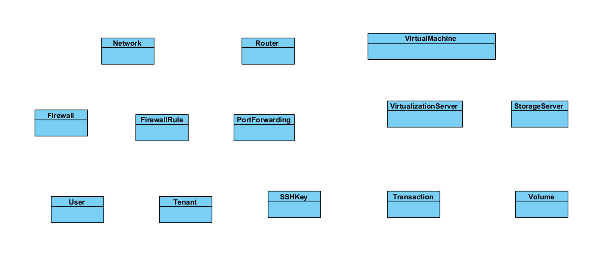

# Documents about InfraForge project

# Description about project

# Entity



## Network

- Each virtual machine must has at least one network, to communicate between others VM and internet.

- ```Network``` Entity allow users/tenant can create their network and attach to their VM

- ```Network``` Entity will has some attribute like this:


```
    - id: Long
    - name: String
    - tenantId: Long
    - subnetName: String //ex: br-int
    - subnetCidr: String //ex: 192.168.20.0/24
    - allocationPool: String //for automation assign IP of subnet to VM. Ex: "192,168.20.100, 192.168.20.200"
    - dnsServers: List<String> //list domain name system server for resolving domain. Ex: ["1.1.1.1", "8.8.8.8"]
    - createdDate: LocalDateTime
```


## SSHKey

- Store SSHKey(include private and public key) of users/tenants allow them can use it for accessing to virtual machine

- This entity will has some attribute like this:

```
    - id: Long
    - tenantId: Long
    - privateKey: String
    - publicKey: String
    - createdDate: LocalDateTime
```

## Router

- Used to forward traffict When two VM on different subnet want to communicate with each other.

- Router will must has some attribute like this:

```
    - id: Long
    - name: String
    - tenantId: Long //for isolated tenant
    - createdDate: LocalDateTime
    - interfaces: List<RouterInterface>
```


## RouterInterface

- For creating interface on Router and attach network to it

- 

## Virtual Machine

- 

## Firewall

- Apply rules to VM for protecting
- Firewall will has some attribute like this:

```
    - id: Long,
    - name: String,
    - createdDate: LocalDateTime
    - tenantId: Long
```

## FirewallRule

## Port Forwarding

## Volume