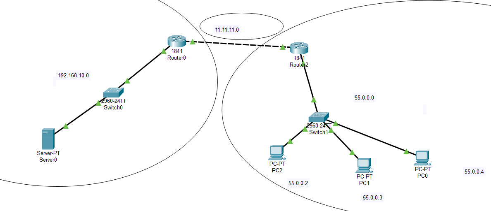

# Access list control
A network acl is a set of rules that either allow or deny traffic based on:
- Source ip address
- Destination ip address
- Protocol (TCP, UDP, ICMP)
- Port number
- Direction(inbound, outbound)
## Acls typically is used on:
- Router
- Firewalls
- Cloud networks

# Type of ACLs
1. Standard ACL: Filters only by source IP address
2. Extended ACL: Filters by source/destination IP, protocol, port number
3. Named ACL: ACLs with human readable names

# ACL Placement
- Inbound: Filter traffic before it enters the interface
- Outbound: Filter traffic after it leaves the interface

# ACL Rules Are Proccessed Top-Down
- The first matching rule is applided
- There is an implicit "Deny all" at the end of every ACL, even if you don't write it.

# Common use cases
- Restrict internal users from accessing specific external sites
- Block ICMP(ping) from outside
- Allow only SSH from trusted IPs
- Secure VLANs or subnet communication


# Range ACL
- Range from 1 - 99 => Standard ACL
- Range from 100 - 199 => Extended ACL
- Named ACL: uses a name intead of a number


# Inverse netmask(wildcard mask)
A wildcard mask is the inverse (bitwise NOT) of a subnet mask.

So:
- A 1 in the subnet mask becomes a 0 in the wildcard
- A 0 in the subnet mask becomes a 1 in the wildcard

It tells the router which bits to ignore when matching IP addresses in ACLs.

## The inverse mask uses:
- 0 to match exactly (must be equal)
- 1 to ignore that bit (allow any value)

### Example
- Match all host in subnet:

```
access-list 10 permit 192.168.1.0 0.0.0.255
```
- Match a single host

```
access-list 10 permit 192.168.1.100 0.0.0.0
```
- Match any hosts

```
access-list 10 permit any
# or access-list 10 permit 0.0.0.0 255.255.255.255
```
### Why we uses inverse netmask intead of subnet mask
Cisco ACLs are matching rules, not routing or addressing rules. So:
- ACLs need to know what part of the address to match
- Inverse mask provides that logic

# ACL Summarization

ACL summarization means combining multiple ACL rules that match similar IP addresses or subnets into fewer, broader entries using subnetting and wildcard masks.

### Why Summarize ACLs?
- Reduces the number of ACL entries
- Improves router performance
- Simplifies configuration and management
- Easier to troubleshoot

### Example
1. Without Summarization

Say you want to permit these 4 subnets:

- 192.168.1.0/24
- 192.168.2.0/24
- 192.168.3.0/24
- 192.168.4.0/24

You could write 4 entries:

```
access-list 100 permit ip 192.168.1.0 0.0.0.255 any
access-list 100 permit ip 192.168.2.0 0.0.0.255 any
access-list 100 permit ip 192.168.3.0 0.0.0.255 any
access-list 100 permit ip 192.168.4.0 0.0.0.255 any
```

2. With Summarization

We analyze the binary patterns and see that we can summarize these subnets into one larger block.

192.168.1.0/24 => 1100000.10101000.00000001.00000000

192.168.2.0/24 => 1100000.10101000.00000010.00000000

192.168.3.0/24 => 1100000.10101000.00000011.00000000

192.168.4.0/24 => 1100000.10101000.00000100.00000000

=> Pattern: 11000000.10101000.00000

=> Choose subnet: 192.168.0.0/23

- Summary Subnet: 192.168.0.0/23
- From netmask we can calculate wildcard: 0.0.1.255

```
access-list 100 permit ip 192.168.0.0 0.0.1.255 any
```

## How to Summarize ACL Entries 
1. List the IPs in binary
2. Find the common prefix
3. Count how many bits match (CIDR notation)
4. Calculate the wildcard mask


## When Not to Summarize
- If some addresses should be excluded
- If the summarized range includes unauthorized IPs
- If you're filtering exact services by port or protocol (summary may be too broad)


# Command with packet tracer

```
access-list <number> <permit|deny> <protocol> <source> <source-wildcard> <destination> <destination-wildcard> [port]

```


<strong>Standard ACL</strong>

```
access-list 10 permit 192.168.1.0 0.0.0.255
```

Used for simple restrictions like:
- Blocking access from a certain subnet
- Limiting Telnet or SSH to routers

<strong>Extended ACL</strong>

Filters by:
- Source IP
- Destination IP
- Protocol (TCP, UDP, ICMP)
- Port numbers

```
access-list 110 deny tcp any host 10.0.0.10 eq 80
access-list 110 permit ip any any
```


<strong> Named ACL</strong>

Standard Named ACL:

```
ip access-list standard ONLY-LAN
 permit 192.168.1.0 0.0.0.255
 deny any
```

Extended Named ACL:

```
ip access-list extended BLOCK-WEB
 deny tcp any host 10.0.0.10 eq 80
 permit ip any any
```
To apply a named ACL:

```interface GigabitEthernet0/1
ip access-group BLOCK-WEB in
```

## Example 1: Permit one IP
```
access-list 100 permit ip host 192.168.1.10 any
```

Explanation:

- 100 → extended ACL number
- permit → allow traffic
- ip → all IP traffic (ICMP, TCP, UDP, etc.)
- host 192.168.1.10 → match only this IP
- any → to any destination


## Example 2: Deny HTTP traffic from a subnet

```access-list 100 deny tcp 192.168.1.0 0.0.0.255 any eq 80
access-list 100 permit ip any any
```

Explanation:

- Deny all TCP traffic from 192.168.1.0/24 to any destination on port 80 (HTTP)

- Then allow everything else (important, or everything will be denied by default)


## Example 3: Apply ACL with ip access-group
This applies the ACL to a router or switch interface.

```
interface <interface-name>
 ip access-group <ACL number or name> <in|out>
```

#### Ex1
```
interface GigabitEthernet0/1
 ip access-group 100 in
```

Explanation:

- Apply ACL 100

- In the inbound direction (traffic entering this interface)

## Example 4: Named ACL
Instead of numbered ACLs, you can use named ACLs:

```
ip access-list extended ALLOW-SERVERS
 permit ip host 192.168.1.10 any
 permit ip 10.0.0.0 0.0.0.255 any
```

Then apply

```
interface GigabitEthernet0/1
 ip access-group ALLOW-SERVERS in
```

## Example 5: Verifying ACLs
View access-lists:

```
show access-lists
```

Remove an ACL:

```
no access-list 120
```

## Common ACL Commands Summary
| Command                                  | Purpose                |
| ---------------------------------------- | ---------------------- |
| `access-list 100 permit ip any any`      | Permit all traffic     |
| `access-list 101 deny tcp any any eq 23` | Block Telnet           |
| `ip access-list extended NAME`           | Start a named ACL      |
| `ip access-group 100 in`                 | Apply ACL to interface |

# Important Notes
- ACLs are processed top-down — first match wins.
- There is an implicit deny all at the end of every ACL.
- Always add a permit ip any any at the end if you want to allow all other traffic.

# Lab with packet tracer
1. Topology


2. From above image i have configured all pc from left side can access to server at right side

3. I will use acl for limit device for accessing to webserver, in this case i will only accept PC1 can access to server.

## Config Router2

```
Router(config)# access-list 110 permit tcp host 55.0.0.3 host 192.168.10.2 eq 80
Router(config)# access-list 110 deny tcp host 55.0.0.2 host 192.168.10.2 eq 80
Router(config)# access-list 110 deny tcp host 55.0.0.4 host 192.168.10.2 eq 80
Router(config)# access-list 110 permit ip any any

---Apply for Router2
Router(config)# int f0/1
Router(config-if)# ip access-group 110 in
```