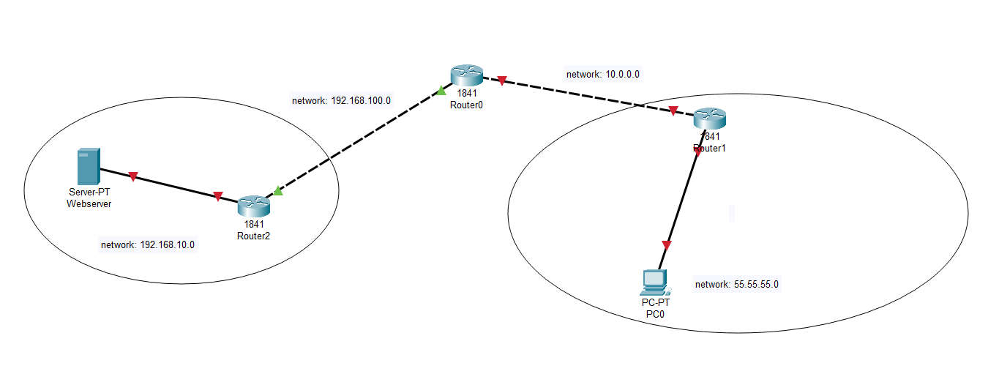

# Note about NAT(Network address traslation)

NAT stands for Network Address Translation. It’s a method used by routers to translate private (local) IP addresses to a public IP address before packets are forwarded to another network, typically the internet. NAT helps conserve IPv4 addresses and adds a layer of security.

# Types of NAT
1. Static NAT (One-to-One NAT):
    - Maps one private IP address to one public IP address.
    - Example use: Hosting a server inside a private network.
    - Fixed mapping.
2. Dynamic NAT:
    - Maps private IP addresses to a pool of public IP addresses.
    - Assignments are made on a first-come, first-served basis.
    - Mapping can change; only works if a public IP is available.

3. PAT (Port Address Translation) – aka NAT Overload:
    - Most common type.
    - Maps multiple private IP addresses to a single public IP using ports to differentiate sessions.
    - Used in home routers and small networks.
    - Efficient and scalable.
4. Bidirectional NAT (Two-Way NAT):
    - Used to translate both source and destination IPs.
    - Often in specialized enterprise or carrier-grade networks.
5. Carrier-Grade NAT (CGN or CGNAT):
    - Used by ISPs to share a small number of public IPs across many customers.
    - Introduces complexity for applications needing inbound connections.

# Outbound and Inbound Traffic
| Direction    | Description                                                                      | Example                                                   |
| ------------ | -------------------------------------------------------------------------------- | --------------------------------------------------------- |
| **Outbound** | Traffic that **originates inside** your network and goes **out to the internet** | A user in your LAN opens Google.com                       |
| **Inbound**  | Traffic that **comes from the internet** into your **internal network**          | Someone on the internet accesses your internal web server |

# Port forwarding(Static PAT)
Port forwarding is a specific, manual form of PAT:
- It creates a static mapping from a public IP:port to a private IP:port.
- Used mainly for inbound connections (e.g., allow Internet to reach internal server).

# In Context of NAT/PAT
```
Outbound NAT (PAT)
```
- Internal device (e.g., 192.168.1.10) wants to access the Internet.
- PAT maps 192.168.1.10:12345 → 203.0.113.1:40000
- Response traffic from the internet comes back to 203.0.113.1:40000, and PAT maps it back to 192.168.1.10:12345.
- This is automatic and is the common form of NAT overload (PAT).
```
Inbound NAT (Port Forwarding / Static PAT)
```
- An internet user tries to access your public IP on a specific port (e.g., 203.0.113.1:8080).
- You forward that traffic to a specific device inside your network (e.g., 192.168.1.10:80).
- This is manual — you must define which ports go where.
- This is what you use when hosting a service inside your network, like a web server, game server, or SSH access.

# Lab with packet tracer
1. Port forwarding <br/>
***Topology***

<b><i>Target</i></b>: PC0 can access to Web server, but it can't access directly to private network. <br/>
- At network contains webserver, i will config nat at <b><i>Router2</i></b> all traffic come to webserver will be sent to 192.168.100.1(right side interface of Router2), then Router2 will send traffic to Webserver at private network 
```
#For router2
Router(config)# ip nat inside source static tcp 192.168.10.2 80 192.168.100.1 8080
```

- At PC2 we must config Router0:
    - With right interface Router0: config nat inside(Tell router that this packet sends from private network and it must be translated)
    ```
    #For router1
    Router(config)# int f0/1
    Router(config-if)# ip nat inside
    ```
    - With left interface Router0: config nat outside(Tell router that all traffic from private network will be traslated to ip address of this interface)
    ```
    #For router1
    Router(config)# int f0/0
    Router(config-if)# ip nat outside
    ```
- After all we must routing traffic among router, so that they can communicate with each other.
```
#For router1
Router(config)# ip route 192.168.100.0 255.255.255.0 10.0.0.1
#For router2
Router(config)# ip route 10.0.0.0 255.0.0.0 192.168.100.2
```

# Lab with linux
