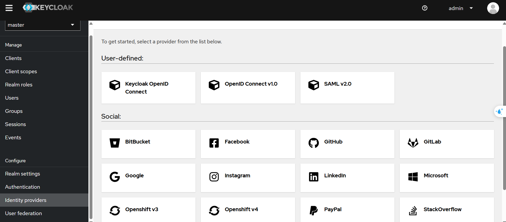
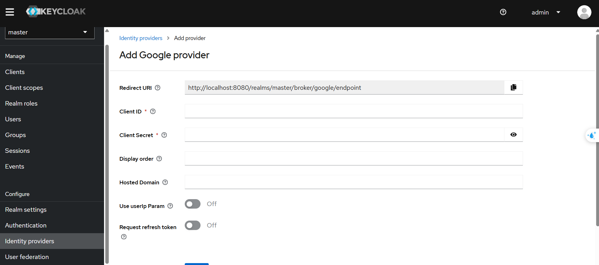
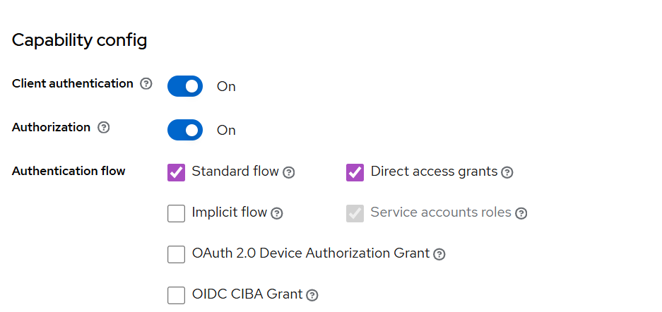

# What is OAuth

OAuth (short for Open Authorization) is an open standard for access delegation, commonly used as a way to grant websites or applications limited access to a user's data without exposing passwords.

## In Simple Terms:

OAuth lets you sign in to a service using another service (like signing into a third-party app using your Google, Facebook, or Apple account) without giving that app your actual credentials.

## Real-World Example:

You want to use a photo editing app that can access your Instagram photos.

- Instead of giving the app your Instagram username and password,

- The app redirects you to Instagram,

- You log in and authorize the app to access your photos,

- Instagram sends the app a token that grants limited access (not your login credentials),

- The app uses this token to get your photos.

## Key Concepts:

| Term                     | Meaning                                                   |
| ------------------------ | --------------------------------------------------------- |
| **Resource Owner**       | You (the user)                                            |
| **Client**               | The app trying to access your data                        |
| **Authorization Server** | The service that authenticates you (like Google)          |
| **Resource Server**      | The server hosting your data (e.g., Instagram API)        |
| **Access Token**         | A short-lived token the app uses instead of your password |


## Why OAuth?
- Security: Your password stays secret.

- Granular Access: You can allow access to only specific data or actions.

- Revocable: You can revoke access without changing your password.

There are two main versions:

- OAuth 1.0a: Older and more complex

- OAuth 2.0: Widely used today, simpler but with its own security concerns if not implemented correctly

## Example

### Scenario:

You’re building a to-do list app and want users to sign in with their Google account and allow access to their email address.

### Authorization Code Flow

1. User Clicks "Login with Google"

Your app sends the user to Google’s OAuth 2.0 server with this kind of URL:

```
https://accounts.google.com/o/oauth2/v2/auth?
  client_id=YOUR_CLIENT_ID
  &redirect_uri=https://yourapp.com/oauth/callback
  &response_type=code
  &scope=email%20profile
  &state=random_string
```

2. User Grants Permission
Google shows a consent screen:

```
"This app wants to view your email address and basic profile info."
```

If the user agrees, Google redirects them to:

```
https://yourapp.com/oauth/callback?code=AUTH_CODE&state=random_string
```

3. Your App Exchanges the Code for a Token

Your server sends a POST request to Google to exchange the AUTH_CODE for an access token:

```
POST https://oauth2.googleapis.com/token

Content-Type: application/x-www-form-urlencoded

grant_type=authorization_code
&code=AUTH_CODE
&redirect_uri=https://yourapp.com/oauth/callback
&client_id=YOUR_CLIENT_ID
&client_secret=YOUR_CLIENT_SECRET
```

4. Google Responds with Access Token

```
{
  "access_token": "ya29.a0AfH6SM...",
  "expires_in": 3599,
  "token_type": "Bearer",
  "scope": "email profile"
}
```

5. Your App Uses the Token to Call Google’s API

```
GET https://www.googleapis.com/oauth2/v1/userinfo?alt=json
Authorization: Bearer ya29.a0AfH6SM...
```

Response:

```
{
  "email": "user@example.com",
  "name": "John Doe",
  "id": "123456789"
}
```

# What is OpenID

OpenID (the original protocol) is an authentication protocol that allows users to log in to multiple websites with a single identity, without having to create new credentials for each site.

It was created in the early 2000s as a decentralized way to prove your identity across different websites.

It mainly handled user authentication (who you are).

# What is OIDC(OpenID Connect)

OpenID Connect is a modern identity layer built on top of OAuth 2.0.

It adds a standardized way to perform user authentication and get user identity information securely.

OIDC issues a special token called an ID Token (a JWT) that contains info about the authenticated user.

It supports single sign-on (SSO), identity federation, and works well with REST APIs and web/mobile apps.

# Key different

| Feature               | OpenID (1.0/2.0)   | OpenID Connect (OIDC)        |
| --------------------- | ------------------ | ---------------------------- |
| Based on              | Its own protocol   | Built on OAuth 2.0           |
| Token Type            | No standard tokens | ID Token (JWT), Access Token |
| Authentication + Info | Limited            | Standardized user info       |
| Popularity            | Largely replaced   | Widely used today            |
| Use Cases             | Early web login    | Modern APIs, mobile apps     |


# How does OpenID Connect work? (Simplified)

User tries to log in to your app.

Your app redirects user to an OpenID Connect provider (like Keycloak, Google).

User authenticates there.

Provider sends back an ID token proving who the user is, plus optionally an access token.

Your app uses this info to log the user in and get profile details.

# What is keycloak

Keycloak is an open-source Identity and Access Management (IAM) solution developed by Red Hat. It helps developers add authentication, authorization, and single sign-on (SSO) capabilities to their applications easily — without having to build those complex features from scratch.

# Key Features of Keycloak

| Feature                              | Description                                                   |
| ------------------------------------ | ------------------------------------------------------------- |
| **Single Sign-On (SSO)**             | Users log in once and get access to multiple apps seamlessly  |
| **User Federation**                  | Connects to existing user databases (LDAP, Active Directory)  |
| **Social Login**                     | Supports login via Google, Facebook, GitHub, and others       |
| **Standard Protocols**               | Supports OAuth 2.0, OpenID Connect, and SAML                  |
| **Centralized User Management**      | Admin console for managing users, roles, and permissions      |
| **Access Tokens and Refresh Tokens** | Issues JWT tokens for secure authentication and authorization |
| **Fine-grained Authorization**       | Role-based and attribute-based access control                 |
| **Customizable Login Screens**       | Customize branding and user experience                        |
| **Multi-Factor Authentication**      | Supports 2FA for increased security                           |


# How Keycloak Works

- Acts as an Authorization Server (also called Identity Provider).

- Your application redirects users to Keycloak for login.

- Keycloak authenticates users and issues tokens (like JWT access tokens).

- Your app uses these tokens to allow or deny access.

- Supports integration with other identity providers (Google, Facebook) for social login.

# Why Use Keycloak?

- Save time by using an enterprise-ready solution.

- Securely manage authentication and authorization.

- Support modern protocols and social logins out of the box.

- Centralize user and session management.

- Customize flows and user experiences.

#  How It Works with Social Login

Keycloak acts as a broker between your app and the external IdP (e.g., Google), handling the OAuth/OpenID Connect process.

When a user logs in via Google (or another IdP):

1. Google issues:

    - An ID token (e.g., expires in 1 hour)

    - An access token (e.g., expires in 1 hour)

    - Possibly a refresh token

2. Keycloak receives these and maps them to a local Keycloak user session.

3. Keycloak then issues its own tokens to your app:

    - Access token

    - ID token

    - Refresh token

4. These tokens follow Keycloak’s expiration settings, not the original provider’s.

# Keycloak Controls These Token Lifespans

You can configure them in the Admin Console:

Navigate:

```
Realm Settings → Tokens
```


| Token Type        | Description                     | Example Default    |
| ----------------- | ------------------------------- | ------------------ |
| **Access Token**  | Used to access APIs             | 5 minutes          |
| **ID Token**      | Contains user info for frontend | 5 minutes          |
| **Refresh Token** | Used to get new access tokens   | 30 minutes or more |


# Practice

## Integrate with social network



You can choose what ever you like to integrate

In this example i will integrate with google



You go to google to get ClientID and Client Secret

<a href='https://console.cloud.google.com/auth/overview/create'>Click here for get API </a>

After you got ClientID and Client Secret then paste it to your keycloak and save it.

After that you go to your page application and test login with google account.

## Verify token on backend server

When you call an api to get data, if your api is protected so you must pass your token to header request.

To verify token we must use public key is provided in keycloak, because token is encrypted by private key that why we need public key to verify it.

```

import jwtmod from 'jsonwebtoken'
export default async (req, res, next) => {
    const beareToken = req.headers['authorization']
    const token = beareToken && beareToken.split(" ")[1]
    console.log("fuck")
    if(token == null) return res.status(401);

    const public_key = `-----BEGIN PUBLIC KEY-----\n${process.env.PUBLIC_KEY}\n-----END PUBLIC KEY-----`;


    const decodedToken = jwtmod.verify(token, public_key, {
        algorithms: "RS256"
    })

    const {email} = decodedToken
    req.user = email

    next()
}
```


# Role base access control

1. To use this function you must change your client setting to like this:



2. Create your client roles or realm role

3. Navigate to your client and click Authorization

    1. Create scope: actions to access resources such as view, edit, delete, manage

    2. Create resources: resources which users access to do something like Documents, Users, Products

    3. Create Policy: Policy tell us what role will be applied

    4. Create Permission = scope + resources + policy: Tell us what role and what scope will be accessed to resources 


## Get permission

1. After you login to your application you will receive access token.

2. Using that token and call API to get RPT token(this contains permissions)

```
POST http://localhost:8080/realms/<your_realm>/protocol/openid-connect/token
Content-Type: application/x-www-form-urlencoded
-H Authorization= Bearer your_access_token
-d grant_type= urn:ietf:params:oauth:grant-type:uma-ticket
-d audience= <your_client_id>
```

## Workflow

- User logs in → frontend gets Access Token.

- Frontend requests RPT token (via UMA endpoint) → caches it.

- Frontend calls backend API, sending RPT token.

- Backend decodes RPT token → checks permissions locally.

- If permission is critical (e.g., delete resource), backend calls entitlement endpoint for fresh permissions.

- Backend returns success or 403.

- If 403 due to expired/insufficient RPT, frontend requests new RPT token.

# Client

| Client Type         | Requires Client Secret? | Typical Use Case                 |
| ------------------- | ----------------------- | -------------------------------- |
| Public Client       | No                      | SPA, mobile apps                 |
| Confidential Client | Yes                     | Backend servers, secure services |
