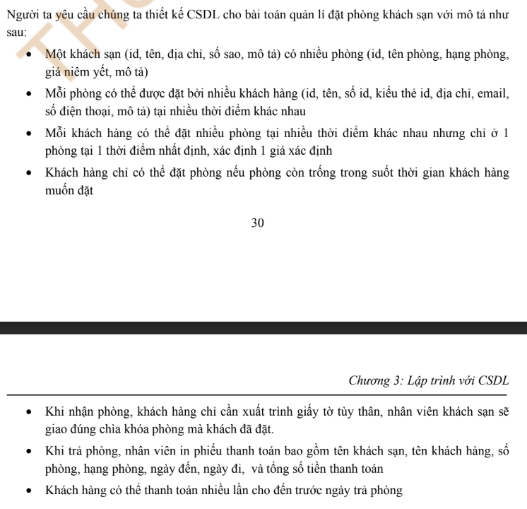

# Cac buoc thiet ke

1. Doc ban mo ta => gap thuc the can quan ly => tao 1 bang
2. xem xet cac quan he giua cac doi tuong
    - 1-1 => gop chung 1 bang
    - 1-n => giu nguyen
    - n-n => tao bang chung gian => (1-n)
3. tao khoa ngoai, khoa chinh
4. Bo sung thuoc tinh con thieu, loai bo thuoc tinh du thua

# Example

## Cac buoc thiet ke

B1: Tu mo ta cua de bai ta de xac dinh duoc 3 doi tuong quan ly thong tin la: `khach san, phong, khach hang`.
Khi tra phong nhan vien in phieu thanh toan, cho nen phai quan ly thong doi tuong `hoa don`. Vay ta co 4 bon doi tuong, tao ra 4 bang ban dau:

- tblHotel
- tblRoom
- tblUser
- tblBill

B2: Xet quan he vua trich duoc

- 1 khach san co nhieu phong, 1 phong chi co the o 1 khach san => quan he `khach san` va `phong` la `1-n`

- 1 khach hang co the dat nhieu phong, 1 phong cung co the duoc nhieu khach hang dat tai cac thoi diem khac nhau, vay quan he giua 2 doi tuong nay la n - n. Tao them 1 bang dat cho chi tiet `tblBooking`

- 1 khach hang co the thanh toan nhieu lan va 1 don chi thuoc ve 1 khach hang do, vay quan he khach hang va hoa don la: `1-n`

B3: them cac khoa ngoai cho quan he giua cac bang

B4: Ra soat lan cuoi cac thuoc tinh

Ket qua: thu duoc CSDL nhu hinh ben duoi:

# Exercise

## Ex1

## Ex2

## Ex3

## Ex3

