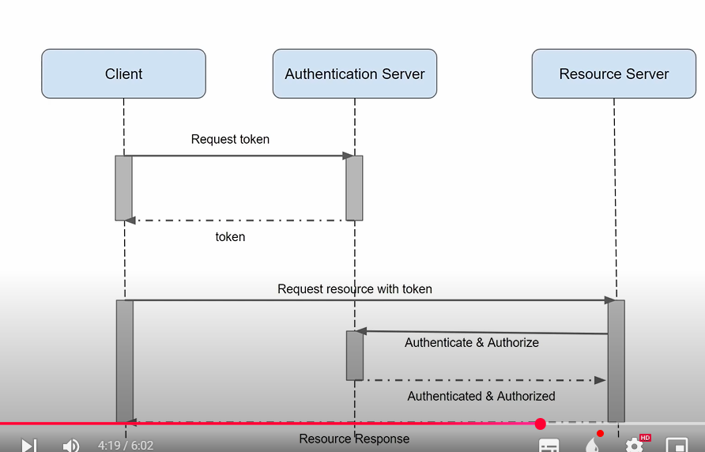

# Note about spring-oauth2-resourceserver

# Authentication process




# What is oauth and oauth2

- OAuth(open authorization): it's an open standard that allows application(client) to access resources(your app data) on another service(resource server) without giving away your password

- OAuth 2.0: is the newer, more flexible, and widely used version of OAuth. It improves security and supports more scenarios like mobile apps, web apps, start TVs and APIS

    - Main concept:
        
        1. Roles
            - Resource owner -> you(the user)
            - Client -> the app that want access
            - Authorization server -> Handle login & issues token
            - Resource server: API or service holding your data
        2. Tokens
            - Access token - short lived credential that lets the app call APIs
            - Refresh Token -> long-lived credential to get net access tokens without logging in again
        3. Grant types(ways to get tokens)
            - Authorization code flow: used by web & mobile apps
            - Client credentials flow: used by server to server apps
            - Password grant: users give username/password directly
            - Implicit flow: for SPAs, now replaced by better flows

# Oauth2 with spring security

- Spring security oauth2 resource server have built some class to control flow authentication

## Some common class 

### 1. `class BearerTokenAuthenticationFilter extends OncePerRequestFilter`

This class will filter the request from users. When users request resources then this class will filter before moving to another step.

```
protected void doFilterInternal(HttpServletRequest request, HttpServletResponse response, FilterChain filterChain) throws ServletException, IOException {
        String token;
        try {
            token = this.bearerTokenResolver.resolve(request);
        } catch (OAuth2AuthenticationException invalid) {
            this.logger.trace("Sending to authentication entry point since failed to resolve bearer token", invalid);
            this.authenticationEntryPoint.commence(request, response, invalid);
            return;
        }

        if (token == null) {
            this.logger.trace("Did not process request since did not find bearer token");
            filterChain.doFilter(request, response);
        } else {
            BearerTokenAuthenticationToken authenticationRequest = new BearerTokenAuthenticationToken(token);
            authenticationRequest.setDetails(this.authenticationDetailsSource.buildDetails(request));

            try {
                AuthenticationManager authenticationManager = this.authenticationManagerResolver.resolve(request);
                Authentication authenticationResult = authenticationManager.authenticate(authenticationRequest);
                SecurityContext context = this.securityContextHolderStrategy.createEmptyContext();
                context.setAuthentication(authenticationResult);
                this.securityContextHolderStrategy.setContext(context);
                this.securityContextRepository.saveContext(context, request, response);
                if (this.logger.isDebugEnabled()) {
                    this.logger.debug(LogMessage.format("Set SecurityContextHolder to %s", authenticationResult));
                }

                filterChain.doFilter(request, response);
            } catch (AuthenticationException failed) {
                this.securityContextHolderStrategy.clearContext();
                this.logger.trace("Failed to process authentication request", failed);
                this.authenticationFailureHandler.onAuthenticationFailure(request, response, failed);
            }

        }
    }
```

## Break it to small piece of code

```
token = this.bearerTokenResolver.resolve(request);
```

- Get token from header `Authorization`: `Bearer <your_token>`

```
BearerTokenAuthenticationToken authenticationRequest = new BearerTokenAuthenticationToken(token);

authenticationRequest.setDetails(this.authenticationDetailsSource.buildDetails(request));

```

- Wrap token into Authentication(like UsernamePasswordAuthentication), in this case we are using token so `spring oauth2 have built this class`

- Set details request of current request(include remoteAddress, sessionId)

```
AuthenticationManager authenticationManager = this.authenticationManagerResolver.resolve(request);
```

- By default `spring security` will use `AuthenticationProvider` for authenticate, but in this case it will use `JwtAuthenticationProvider` for authentication token

- `authenticationManagerResolver` is instance of `AuthenticationManagerResolver`(in this case: `JwtIssuerAuthenticationManagerResolver`): This class use to build `AuthenticationManager`

```
public AuthenticationManager resolve(String issuer) {
    if (this.trustedIssuer.test(issuer)) {
        AuthenticationManager authenticationManager = (AuthenticationManager)this.authenticationManagers.computeIfAbsent(issuer, (k) -> {
            this.logger.debug("Constructing AuthenticationManager");
            JwtDecoder jwtDecoder = JwtDecoders.fromIssuerLocation(issuer);
            JwtAuthenticationProvider var10000 = new JwtAuthenticationProvider(jwtDecoder);
            return var10000::authenticate;
        });
        this.logger.debug(LogMessage.format("Resolved AuthenticationManager for issuer '%s'", issuer));
        return authenticationManager;
    } else {
        this.logger.debug("Did not resolve AuthenticationManager since issuer is not trusted");
        return null;
    }
}
```

```
 JwtDecoder jwtDecoder = JwtDecoders.fromIssuerLocation(issuer)
```

- This object will be used to verify token(wether it from trusted issuers)
- issure is usually property have defined in application.properties:
    
    - `spring.security.oauth2.resourceserver.jwt.issuer-uri=http://localhost:60000/realms/test`

- Details method:

    ```
    public static <T extends JwtDecoder> T fromIssuerLocation(String issuer) {
        Assert.hasText(issuer, "issuer cannot be empty");
        NimbusJwtDecoder jwtDecoder = NimbusJwtDecoder.withIssuerLocation(issuer).build();
        OAuth2TokenValidator<Jwt> jwtValidator = JwtValidators.createDefaultWithIssuer(issuer);
        jwtDecoder.setJwtValidator(jwtValidator);
        return (T)jwtDecoder;
    }
    ```

    - `NimbusJwtDecoder jwtDecoder = NimbusJwtDecoder.withIssuerLocation(issuer).build()`: the decoder will fetch the json response from Authorization Server and look up key: `jwks_uri` to fetch `public_key` from that url

    - You can also provide `jwks_uri` directly inside `application.properties` so that spring dont need to look up `jwks_uri` it can use to fetch `public_key` directly:

        - `spring.security.oauth2.resourceserver.jwt.jwk-set-uri=http://localhost:60000/realms/test/protocol/openid-connect/certs`

    - Access tokens are generated and encrypted by using private key so we need public key to verify, so that it is purpose of this inteface(class)

```
JwtAuthenticationProvider var10000 = new JwtAuthenticationProvider(jwtDecoder);
```

- This object used to extract roles, permissions from token
- `JwtAuthenticationProvider extends AuthenticationProvider` and overidde method authenticate like this:

    ```
    public Authentication authenticate(Authentication authentication) throws AuthenticationException {
        BearerTokenAuthenticationToken bearer = (BearerTokenAuthenticationToken)authentication;
        Jwt jwt = this.getJwt(bearer);
        AbstractAuthenticationToken token = (AbstractAuthenticationToken)this.jwtAuthenticationConverter.convert(jwt);
        if (token.getDetails() == null) {
            token.setDetails(bearer.getDetails());
        }

        this.logger.debug("Authenticated token");
        return token;
    }
    ```

    - `this.getJwt(bearer)`: using `Decorder` object which i have written above to verify `token` and extract data in token in to `Jwt` object
    - `this.jwtAuthenticationConverter` this object used to convert `Jwt` object into `AbstractAuthenticationToken` which will contains roles, permissions of current user request
    
    ```
    private Converter<Jwt, ? extends AbstractAuthenticationToken> jwtAuthenticationConverter = new JwtAuthenticationConverter();
    ```

    ```
     public final AbstractAuthenticationToken convert(Jwt jwt) {
        Collection<GrantedAuthority> authorities = (Collection)this.jwtGrantedAuthoritiesConverter.convert(jwt);
        String principalClaimValue = jwt.getClaimAsString(this.principalClaimName);
        return new JwtAuthenticationToken(jwt, authorities, principalClaimValue);
    }
    ```

    - `jwtGrantedAuthoritiesConverter` is also a converter to convert `Jwt` to Collection roles


```
Authentication authenticationResult = authenticationManager.authenticate(authenticationRequest);
```

- This part will authenticate(it will use `JwtAuthenticationManager`(have said above))


```
SecurityContext context = this.securityContextHolderStrategy.createEmptyContext();
context.setAuthentication(authenticationResult);
this.securityContextHolderStrategy.setContext(context);
this.securityContextRepository.saveContext(context, request, response);
```

- Save authentication to security context: it using `ThreadLocal` for isolation among requests, people can't see information of each others.
