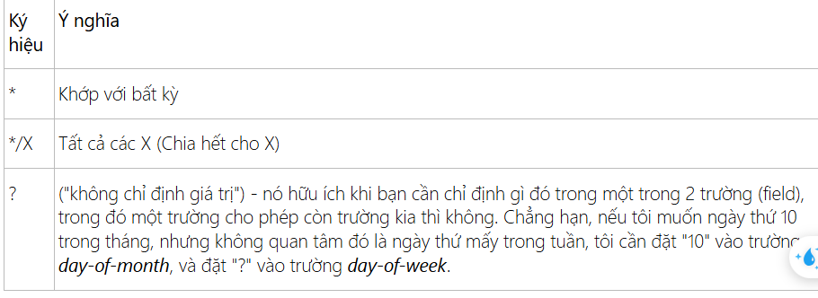

# Note about background worker scheduler

Cac worker(method) chay ngam theo 1 lich trinh dat san

# 1. @Scheduled

La mot annotation cau hinh lich trinh, duoc gan tren phuong thuc => duoc chay theo lich

## Attribute

```
public @interface Scheduled {

    /**
    la 1 bieu thuc no chua 6 truong: giay, phut, gio, ngay trong thang, thang, ngay cua tuan. Giup chi dinh 1 lich trinh phuc tap
    **/
    String cron() default "";
 
    /**
    Mot mui gio ma bieu thuc cron se duoc dung(mac dinh la rong(mui gio dia phuong cua may chu duoc su dung))
    **/
    String zone() default "";
 
    /**
    Thực thi các phương thức được chú thích (annotated), sau khi hoàn thành nghỉ một khoảng thời gian cố định theo mili giây, sau đó thực thi lượt tiếp theo.
    **/
    long fixedDelay() default -1;
 
    String fixedDelayString() default "";
 
    /**
    Thực thi phương thức được chú thích (annotated), với một khoảng thời gian cố định giữa các lần gọi.
    **/
    long fixedRate() default -1;
 
    String fixedRateString() default "";
    
    /**
    Khoảng thời gian tính bằng mili giây tạm dừng trước khi thực thi lần đầu tiên, sử dụng cùng với fixedRate() hoặc fixedDelay().
    **/
    long initialDelay() default -1;
 
    String initialDelayString() default "";
}
```

# Config

De co the chay can su dung annotation `@EnableScheduling`


# Practice

## Example voi fixedDelay

```
@Scheduled( initialDelay = 3 * 1000, fixedDelay = 2 * 1000)
public void writeCurrentTime() {
    
    Date now = new Date();
    
    String nowString = df.format(now);
    
    System.out.println("Now is: "+ nowString);
}
```

- Note:

    - initialDelay => sau 3 giay method moi chay
    - fixedDelay => khi method chay sau 2 giay sau no moi chay lai

## Example voi fixedDelay va fixedRate

Chi duoc su dung 1 trong 2 trong annotation

- fixedRate  => là khoảng thời gian giữa lần bắt đầu thực thi nhiệm vụ trước và lần bắt đầu thực thi nhiệm vụ tiếp theo, nó không phụ thuộc vào nhiệm vụ trước đã kết thúc hay chưa.

## Bieu thuc cron

6 truong dai dien cho cron:

```
second, minute, hour, day of month, month, day(s) of week
```

- Example

```
"0 0 * * * *" // Đầu giờ của tất cả các giờ của tất cả các ngày.

"*/10 * * * * *" // Mỗi 10 giây (số giây chia hết cho 10).

"0 0 8-10 * * *" // 8, 9 và 10 giờ các ngày

"0 0/30 8-10 * * *" // 8:00, 8:30, 9:00, 9:30 và 10 tất cả các ngày

"0 0 9-17 * * MON-FRI" // 9, .. 17 giờ các ngày thứ 2 tới thứ 6 (monday & friday)

"0 0 0 25 12 ?" // Tất cả các ngày giáng sinh, nửa đêm.
```

# Y nghia ky hieu



```
0 0 0 25 12 ? => ngay 25 thang 12
0 20 1 * * MON-THU => thu 2 den thu 5 vao luc 1h20p
```