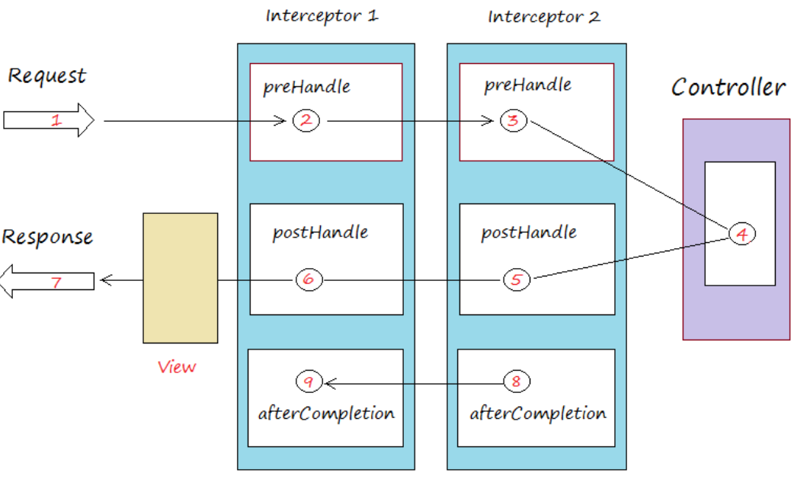

# Note about filter and interceptor


- Filter => se filter request truoc khi vao web servlet containers

- Interceptor => sau khi request vuot qua web servlet containers sau no se filter endpoint truoc va sau khi endpoint duoc thien hien xong

- Trong spring boot thong thuong filter su dung cho viec security

- Interceptor thuong dung cho log

Trong spring co 3 loai interceptors:

    - preHandle => 
    - postHandle
    - afterCompletion

Flow thuc hien:



Gia su truy cap endpoint: 

`/api/posts`

di qua prehandle(in1)

- Neu tra ve la true => i1 ok then forward to prehandle(in2)
- Neu false thi reject request

Sau khi qua prehandle(in2) => forward to controller(method with specific endpoint will be called)

=> After that controller ok => postHandle(in2) => postHandle(in1) => response to user

After response to user then afterCompletion(in2) is called then forward to afterCompletion(in1)

=> Flow completed


# Config interceptors

1. Implements Interface `HandlerInterceptorAdapter `

2. Register interceptors de no hoat dong by extends `WebMvcConfigurerAdapter `(`WebMvcConfigurer `)

3. Override method `addInterceptors`

```
public void addInterceptors(InterceptorRegistry registry) {
		// LogInterceptor áp dụng cho mọi URL.
		registry.addInterceptor(new LogInterceptor());

		// Đường dẫn login cũ, không còn sử dụng nữa.
		// Sử dụng OldURLInterceptor để điều hướng tới một URL mới.
		registry.addInterceptor(new OldLoginInterceptor())//
				.addPathPatterns("/admin/oldLogin");

		// Interceptor này áp dụng cho các URL có dạng /admin/*
		// Loại đi trường hợp /admin/oldLogin
		registry.addInterceptor(new AdminInterceptor())//
				.addPathPatterns("/admin/*")//
				.excludePathPatterns("/admin/oldLogin");
	}
```


