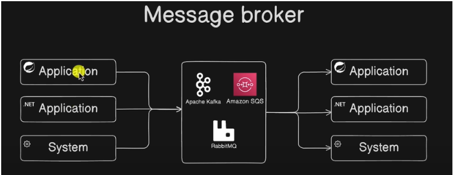
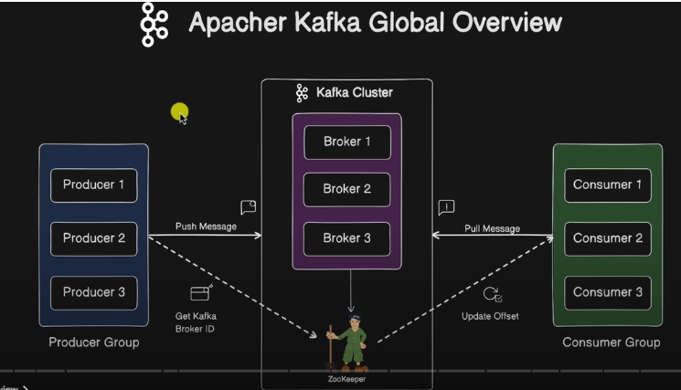
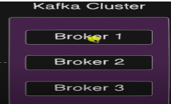
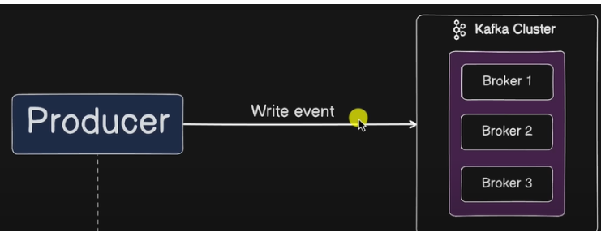
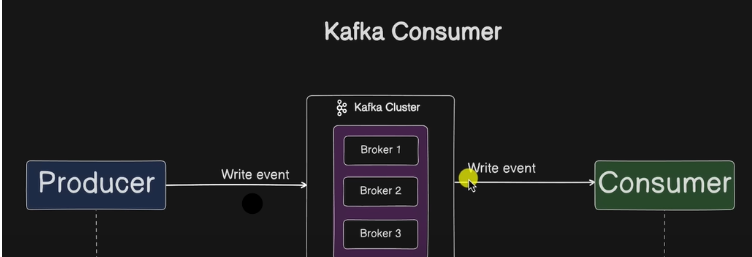
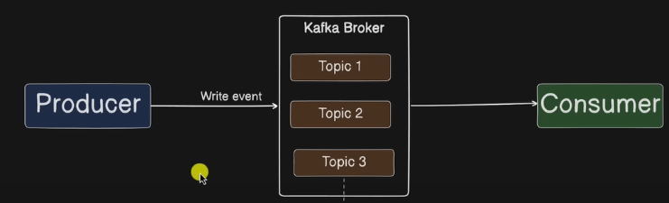
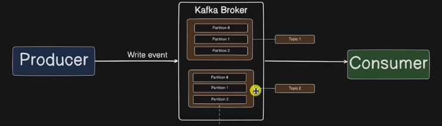
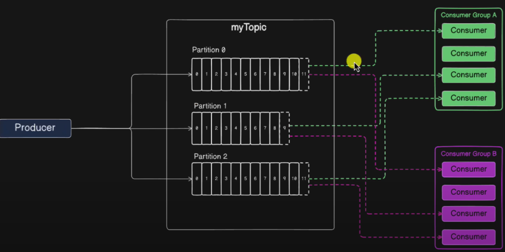

# Note about kafka and details

# Table of Contents

- [Kafka introduction](#kafka-introduction)
  - [1. Message broker](#1-message-broker)
  - [2. What is Apache Kafka?](#2-what-is-apache-kafka-)
    - [2.1. Kafka cluster](#21-kafka-cluster)
    - [2.2. Kafka broker](#22-kafka-broker)
    - [2.3. Kafka producer](#23-kafka-producer)
    - [2.4. Kafka consumer](#24-kafka-consumer)
    - [2.5. Kafka topic](#25-kafka-topic)
    - [2.6. Kafka partition](#26-kafka-partition)
    - [2.7. Kafka offsets](#27-kafka-offsets)
    - [2.8. Consumer groups](#28-consumer-groups)
    - [2.9. Rebalancing](#29-rebalancing)
  - [3. Case study](#3-case-study)
    - [1. One consumer consumes multiple topics](#1-one-consumerone-instance-consume-multiple-topic)
    - [2. How Kafka puts messages into partitions](#2-how-kafka-puts-messages-into-partitions)
  - [4. Zookeeper](#4-zookeeper)
  - [5. Download Kafka](#5-download-kafka)
- [Kafka with Spring Boot](#kafka-with-spring-boot)
  - [1. Dependency](#1-dependency)
  - [2. Config](#2-config)
  - [3. Kafka producer](#3-kafka-producer)
  - [4. Consumer](#4-consumer)
  - [5. Test](#5-test)
  - [Custom type in Spring](#custom-type-spring)

# Kafka introduction

## 1, Message broker

Message broker is centralize for communication between  system



A system produced message then another system will be consumed that message

## 2, What is apache kafka ?



Apache kafka is a distribution system for fault tolerant and high scalability message broker, was designed for asynchronous data stream

### 2.1. Kafka cluster




Within the context of kafka: A cluster is a group of brokers/servers working together for three reasons: 

1. speed(low latency)

    - Data will be processed by separate servers , which decrease latency of data delivery

2. durability

    - Data is replicated a cross brokers, if one failed then another server will be backed up ensuring stability

3. scalability

    - We can add brokers to cluster for decrease offload from others in cluster

### 2.2. Kafka broker

Kafka brokers are servers with special jobs to do: managing load balancing, replication.

- How do they get these jobs done:
    Developers start bootstrap server for run kafka cluster, These are the first servers in cluster

### 2.3. Kafka producer



Kafka producer is a application client that publish(write) event message to kafka cluster

### 2.4. Kafka consumer



Kafka consumer is a application client that consume to (read or process) event from kafka cluster

### 2.5. Kafka topic



Kafka topic is a logical channel in which records are published by producers or consumed by consumers. Topic serves as a way to organize and categorize the messages within the kafka messaging system. 

### 2.6. Kafka partition



A partition is a subdivision of a topic:

    - Each topic can have more partitions

    - Each partition is an ordered, immutable sequence of records

    - Messages are appeded at the end of partition
    
    - Each partition lives on one broker(can be replicated across others)

    - Partition allow paralellism(different comsumers can read different partitions)
    - Allow scalability

#### Example

Topic order with 3 partitions

```
orders-0:  msg1 → msg4 → msg7
orders-1:  msg2 → msg5 → msg8
orders-2:  msg3 → msg6 → msg9
```

### 2.7. Kafka offsets

An offset is the unique ID of a record within a partition

- It’s a monotonically increasing number (starts at 0, then 1, 2, 3…).

- Every message in a partition has one offset.

- The consumer uses offsets to track where it is in the partition.


#### Example(Partition 0):

```
Offset:   0    1    2    3    4
Message: msgA msgB msgC msgD msgE
```

- If a consumer reads up to offset 2 → it has seen msgA, msgB, msgC.

- Next fetch will start at offset 3.

### 2.8. Consumer groups



A consumer group is a set of consumers (instances of your app) that work together to consume data from a topic.

- Each consumer in the group has the same group.id.

- Kafka guarantees that each partition of a topic is consumed by only one consumer in the group.

- Consumers in different groups can independently consume the same data.

### Why consumer groups

- Parallelism → multiple consumers share the work of reading a topic.

- Scalability → you add more consumers when traffic increases.

- Fault tolerance → if one consumer fails, Kafka reassigns its partitions to others in the group.

### How works

Suppose topic orders has 4 partitions (P0, P1, P2, P3).

### Case A: One Consumer in the Group

```
Consumer Group: G1
Consumer C1 → reads P0, P1, P2, P3
```

One consumer handles all partitions.

### Case B: Two Consumers in the Group

```
Consumer Group: G1
Consumer C1 → reads P0, P1
Consumer C2 → reads P2, P3
```


Kafka divides partitions among consumers.

### Case C: Four Consumers in the Group

```
Consumer Group: G1
Consumer C1 → P0
Consumer C2 → P1
Consumer C3 → P2
Consumer C4 → P3
```

Each consumer gets exactly one partition.

### Case D: More Consumers than Partitions

```
Consumer Group: G1
Consumer C1 → P0
Consumer C2 → P1
Consumer C3 → P2
Consumer C4 → P3
Consumer C5 → idle
```

Extra consumers sit idle (Kafka won’t split a partition across multiple consumers).

### Offsets in Consumer Groups

When consumers are in a group, Kafka needs to track where each consumer (in that group) is in each partition.

- Kafka stores this info in a special internal topic: __consumer_offsets.

- So for each consumer group, Kafka keeps a record like:

```
Group ID      Topic     Partition     Last Committed Offset
fraud-check   payments  0             105
fraud-check   payments  1             87
analytics     payments  0             200
analytics     payments  1             190
```

### Committed vs Current Offset

- Current offset → where the consumer is right now (in memory).

- Committed offset → where the consumer has said: “I’m done with messages up to here.”

- If a consumer crashes, it restarts from the last committed offset.

### Offset Commit Strategies

- Automatic commit

    - Consumer automatically commits offsets at intervals (e.g., every 5 seconds).

    - Easier but risky → if consumer crashes after reading but before processing, message may be lost.

- Manual commit

    - App explicitly commits offset after processing a message.

    - Safer but requires more code.

### 2.9. Rebalancing

Rebalancing is a process where kafka redistributed partitions to consumer in consumer groups when ever number of consumer groups or number of partitions changes.

### How rebalancing

- Coordinator (on a broker) manages each consumer group.

- When membership changes, coordinator pauses consumption.

- It assigns partitions to active consumers based on the assignment strategy.

- Consumers sync offsets and resume reading.

### Partitions assignment strategies

Kafka supports several strategies:

- Range → partitions divided in ranges (e.g., 0–2 → C1, 3–5 → C2).

- Round-Robin → partitions assigned in round-robin order (P0 → C1, P1 → C2, P2 → C1, …).

- Sticky → tries to minimize movement of partitions (keep same ownership if possible).


## 3. Case study

## 1. One consumer(one instance) consume multiple topic

- In case one instance consume multiple topic then it will use multithreading for consuming message from partition of each topic

## 2. How kafka puts messages into partitions

1. If message has a key

    - Kafka applies a hash(key) % number_of_partitions.

    - This ensures all messages with the same key always go to the same partition → guarantees ordering for that key.

    - Example: user_id = 42 → always lands in partition 2.

2. If no key is provided

    - Kafka defaults to round-robin distribution (balanced across partitions).

    - This ensures load is evenly spread but does not guarantee ordering.


## 4. Zookeeper

## 5. Download kafka:
Guideline:  https://www.youtube.com/watch?v=BwYFuhVhshI&ab_channel=AmpCode
https://kafka.apache.org/downloads

# Kafka with spring boot

## 1. Dependency

```
<dependency>
        <groupId>org.springframework.kafka</groupId>
        <artifactId>spring-kafka</artifactId>
</dependency>
```

## 2. Config

```

# kafka broker
spring.kafka.bootstrap-servers=localhost:9092

#join group consumers
spring.kafka.consumer.group-id=my-group-id
```

You can join to multiple groups by using `@KafkaListener(topics = "my-topic", groupId = "group-1")` it will overwrite group in config

## 3. Kafka producer

```
@Configuration
public class KafkaProducerConfig {
    @Bean
    public ProducerFactory<String, String> producerFactory() {
        Map<String, Object> configProps = new HashMap<>();
        configProps.put(ProducerConfig.BOOTSTRAP_SERVERS_CONFIG, "localhost:9092");
        configProps.put(ProducerConfig.KEY_SERIALIZER_CLASS_CONFIG, StringSerializer.class);
        configProps.put(ProducerConfig.VALUE_SERIALIZER_CLASS_CONFIG, StringSerializer.class);
        return new DefaultKafkaProducerFactory<>(configProps);
    }
    @Bean
    public KafkaTemplate<String, String> kafkaTemplate() {
        return new KafkaTemplate<>(producerFactory());
 }
}
```

Message producer:

```
@Component
public class MessageProducer {

    @Autowired
    private KafkaTemplate<String, String> kafkaTemplate;

    public void sendMessage(String topic, String message) {
        kafkaTemplate.send(topic, message);
    }

}
```

## 4. Consumer

```
@Configuration
public class KafkaConsumerConfig {

    @Bean
    public ConsumerFactory<String, String> consumerFactory() {
        Map<String, Object> configProps = new HashMap<>();
        configProps.put(ConsumerConfig.BOOTSTRAP_SERVERS_CONFIG, "localhost:9092");
        configProps.put(ConsumerConfig.GROUP_ID_CONFIG, "my-group-id");
        configProps.put(ConsumerConfig.KEY_DESERIALIZER_CLASS_CONFIG, StringDeserializer.class);
        configProps.put(ConsumerConfig.VALUE_DESERIALIZER_CLASS_CONFIG, StringDeserializer.class);
        return new DefaultKafkaConsumerFactory<>(configProps);
    }

    @Bean
    public ConcurrentKafkaListenerContainerFactory<String, String> kafkaListenerContainerFactory() {
        ConcurrentKafkaListenerContainerFactory<String, String> factory = new ConcurrentKafkaListenerContainerFactory<>();
        factory.setConsumerFactory(consumerFactory());
        return factory;
    }

}
```

Message consumer:

```
@Component
public class MessageConsumer {

    @KafkaListener(topics = "my-topic", groupId = "my-group-id")
    public void listen(String message) {
        System.out.println("Received message: " + message);
    }
}
```

## 5. Test

```

@RestController
public class KafkaController {

    @Autowired
    private MessageProducer messageProducer;

    @PostMapping("/send")
    public String sendMessage(@RequestParam("message") String message) {
        messageProducer.sendMessage("my-topic", message);
        return "Message sent: " + message;
    }

}
```

## Custom type spring

Default spring will be key-value(string, string) to produce and consume data

### Custom with pair: key-value(string, json)

```
@Bean
public ProducerFactory<String, MyEvent> producerFactory() {
    Map<String, Object> config = new HashMap<>();
    config.put(ProducerConfig.BOOTSTRAP_SERVERS_CONFIG, "localhost:9092");
    config.put(ProducerConfig.KEY_SERIALIZER_CLASS_CONFIG, StringSerializer.class);
    config.put(ProducerConfig.VALUE_SERIALIZER_CLASS_CONFIG, JsonSerializer.class);
    return new DefaultKafkaProducerFactory<>(config);
}

@Bean
public KafkaTemplate<String, MyEvent> kafkaTemplate() {
    return new KafkaTemplate<>(producerFactory());
}
```

Pojo object:

```
public class MyEvent {
    private String id;
    private String data;
    // getters/setters
}
```

Producer:

```
@Autowired
private KafkaTemplate<String, MyEvent> kafkaTemplate;

public void sendEvent(MyEvent event) {
    kafkaTemplate.send("my-topic", event);
}
```