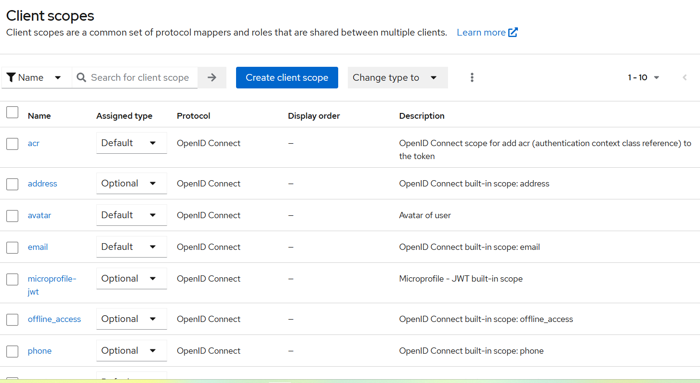
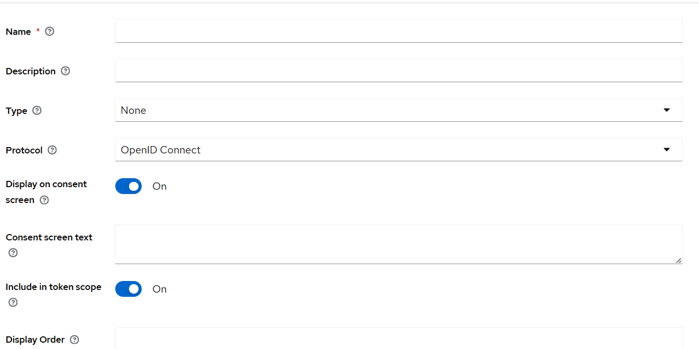
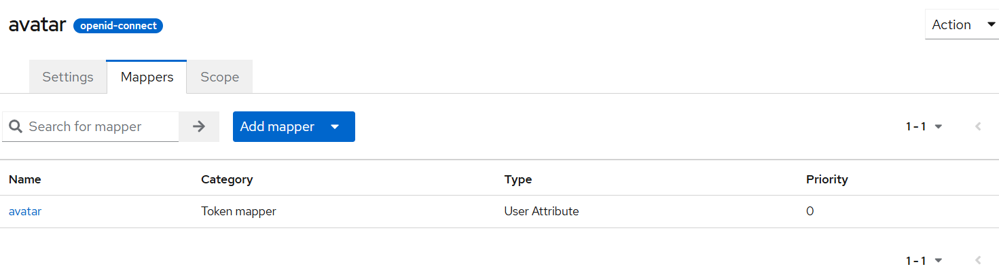

# Note about keycloak

# Introduction Keycloak

- Keycloak is an open-source IAM(identity access managment)(authenticate and resources management) system developed by Red hat(part of IBM)

- It provides SSO(single sign-on), authen, authorization for applications and services

## Keyfeature

## 1. Single Sign On

Users login once, then access multiple apps without re-login.

Example:

You have many app and all of them are using keycloak for IAM when you login to App1 then go to App2 and you dont need login

## 2. User management

Manage users, groups, roles, and attributes.

## 3. Strong authentication

Password, OTP, WebAuthn, Kerberos, 2FA.

## 4. Authorization services

Role-based and fine-grained policies (RBAC + ABAC).

## 4.1 Role-based access control(RBAC)

- A role represents a set of permissions
- Users get roles -> roles grant permissions

### In keycloak:

- Realm roles -> global across the realm

    - Global role can access to any client

- Client roles -> specific to a client(app)

- Roles can be mapped to users or groups

- Client scopes

    - Config new attribute to token of specific client

        

    - Create new attribute by click button client scope

        

        -Type: Default or Optional: Default will be added to client when it created
    - 

        - Token mapper type => will be added to token claims
    - For scopes so only user have specific scopes will has attribute

### Example

- Roles: `admin`, `editor`, `viewer`
- Alice has role admin → can manage all resources.
- Bob has role viewer → can only read.

```
{
  "realm_access": {
    "roles": ["admin"]
  },
  "resource_access": {
    "my-app": {
      "roles": ["editor"]
    }
  }
}
```

## 4.2. Attribute-Based Access Control (ABAC)

- Access based on attributes (properties) of users, resources, or environment.

- Policies are defined with conditions.

### In keycloak

Attributes can be stored in users, groups, or tokens.

Policies can check:

- User attributes (e.g., department=finance).

- Resource attributes (e.g., resource.owner = user.id).

- Environment attributes (e.g., time < 6PM, IP in range).

### Example:

- Policy: “Only employees in department=HR can access /hr/reports.”

- Policy: “Only the owner of a document can delete it.”

```
{
  "sub": "1234",
  "email": "alice@company.com",
  "attributes": {
    "department": "HR",
    "clearance": "level3"
  }
}
```

### 4.3 Fine-Grained Authorization in Keycloak

Keycloak has a full Authorization Services module that supports RBAC + ABAC together.
It uses 3 main concepts:

1. Resources

- Protected objects (APIs, endpoints, documents).

- Example: /orders, /hr/reports, document:1234.

2. Policies

- Rules that decide access.

- Types: Role-based, Attribute-based, JS script, Time, Aggregated policies.

3. Permissions

- Link a Resource + Policy.

- Example: Resource = /orders, Policy = "Role = manager".

### How fine-grained authorization works

1. Your app asks Keycloak for an authorization decision or entitlement.

2. Keycloak checks the configured resources, scopes, and policies.

3. Keycloak issues a token (JWT) with permissions (or denies access).

4. Your app enforces the decision based on the token.

### Example action

- Scenario: Document Management System

- Resource: document:1234

- Scopes: view, edit, delete

Policies:

- Role Policy: admin can do anything.

- User Attribute Policy: Users in department=HR can view HR documents.

- Ownership Policy: Only the document owner can delete it.

- Time Policy: Access allowed only 9AM–6PM.

Permissions:

- Resource document:1234, Scope delete → Policy: Ownership Policy.

Result:

- Alice (HR employee, document owner) can delete her doc at 2PM.

- Bob (Engineering, not owner) cannot delete it.

- Admin can delete it anytime.


## 5. Token-based security

uses OAuth2, OpenID Connect, and SAML.

## 5.1. OAuth2

## 5.2. OpenID Connect

- It is an identity layer built on top of OAuth 2.0
- OAuth 2.0 only handles authorization(who can access what)
- OIDC adds authentication (who the user is)

## Concept in OIDC

1. Relying party

    - Application(client) that needs to authenticate users
    - Ex: React app, backend api

2. OpenID Provider (OP)

    - The identity provider(keycloak, google)
    - It verifies the users' identity and issues tokens
3. End-User
    - The actual person logging in
4. ID Token
    - JWT that proves the user's identity
    - Contains claims like `sub`(userId), `email`, `preferred_username`

5. Access token
    - Used to access APIs(not for identity, but for authorization)
6. Refresh Token
    - Used to get new access tokens without logging in agains

## How OIDC works

Example: User logging into your app with Google via Keycloak.

1. User tries to access App

- App redirects user to Keycloak (the broker).

2. Keycloak redirects to Google (IdP)

- User logs in with Google account.

3. Google authenticates User

- Sends back an ID Token + Access Token to Keycloak.

4. Keycloak processes token

- Keycloak either creates/links a user and issues its own Keycloak ID Token + Access Token to your app.

5. App trusts Keycloak

- App receives the ID Token (user identity) and Access Token (for APIs).

## 5.3. SAML

- XML-based authentication and authorization protocol(older than OIDC)
- Widely used in enterprise enviroments

### How SAML work


1. User -> SP(service provider)

    - User tries to login to an application

2. SP -> Identity Provider(IdP)

    - The app redirect user to the IdP

3. IdP Authenticates User

    - User logs in

4. IdP issues a SAML Assertions(Token)

    - A SAML Assertion = XML document that contains authentication & authorization data
    - Signed by the IdP

5. Assertion -> SP

    - The SAML Assertion is returned to the app

6. App validates & Grants Access

    - App verifies the assertion
    - App now trusts that the user is authenticated

### SAML "Token" = SAML Assertion

In SAML token is called an Assertion

    - Authentication statement:
        - Confirms user has been authenticated by IdP
    - Attribute statement
        - User attributes(like OIDC claims)
    - Authorization decision statement
        - What resources of current user can access


## 6. Extensible

Can add custom providers, mappers, and flows.

### 1. Custom Providers

A provider in Keycloak is a module that adds functionality to Keycloak.

Keycloak has a Service Provider Interface (SPI) system that allows you to implement your own logic.

### Types of Providers

- User Storage Provider

    - Connect Keycloak to custom user stores (databases, LDAP, REST APIs).

    - Example: Pull users from a legacy system.

- Authenticator Provider

    - Custom login logic or authentication mechanisms.

    - Example: Custom 2FA, biometric authentication, or third-party API check.

- Event Listener Provider

    - Trigger actions when events happen (login, logout, registration).

    - Example: Send Slack notification when a user logs in.

- Protocol Mapper Provider

    - Custom logic to map Keycloak attributes to tokens (JWT).

    - Identity Provider (IdP) Mapper

    - Map external IdP data (from Google, SAML, OIDC) to Keycloak user attributes.

### 2. Custom Mappers


Mappers define how Keycloak data appears in tokens or how external IdP data maps to Keycloak.

Used in client scopes, ID tokens, SAML assertions, and OIDC tokens.


- Protocol Mapper

    - Map user attribute department → JWT claim dept.

    - Map roles → custom token claim.

- Identity Provider Mapper

    - Map external IdP attributes into Keycloak user attributes.

    - Example: Map Google given_name → Keycloak firstName.

### 3. Custom Authentication Flows


Authentication flows define the steps a user must go through to log in.

Keycloak allows custom flows, which are sequences of authentication executions.

#### Flow Structure

- Flow → sequence of executions

- Execution types:

    - Required → must succeed.

    - Alternative → succeed if any succeeds.

    - Conditional → execute only if condition is true.

#### Examples of Custom Flows

- Two-Factor Authentication (2FA)

    - Step 1: Password

    - Step 2: OTP

    - Step 3: WebAuthn

#### Custom Social Login Flow

- Step 1: Redirect to external IdP

- Step 2: Map IdP attributes to local user

- Step 3: Additional consent or validation

#### Risk-Based Authentication

- Step 1: Password

- Step 2: Evaluate IP, device, location

- Step 3: Require additional verification if risk is high

#### How to Implement

- Admin Console → Authentication → Flows → Create New Flow or Copy Existing

- Developers can create custom authenticators in Java and deploy as provider.

## 7. Identity Brokering

Connect with social logins (Google, GitHub, Facebook, etc.) or enterprise IdPs (SAML, OIDC, LDAP, Active Directory).

# Some class in Keycloak

1. KeycloakSession is a current session request of user like SecurityContextHolder

```
Incoming Request
       │
       ▼
KeycloakSessionFactory.create()
       │
       ▼
KeycloakSession (thread-local) active
       │
       ├─ Access realm, user, client data
       ├─ Generate tokens
       ├─ Apply mappers
       │
       ▼
Request processed
       │
       ▼
KeycloakSession.close() → commits/rollbacks transaction
```

2. RealmModel => the realm which token will be issued
3. ClientModel => the client(application) which token will be issued
4. UserModel => the user associated token(contains info of user)
5. UserSessionModel => the user's current session(contain info user after logged in)
6. ClientSessionContext => context about the client session such as requested scopes

# keycloak api

## 1. Authentication & Tokens (OIDC / OAuth2)

Base path: `/realms/{realm}/protocol/openid-connect`

| Endpoint                        | Method   | Purpose                                                                  |
| ------------------------------- | -------- | ------------------------------------------------------------------------ |
| `/auth`                         | GET      | Authorization Code login endpoint (used in browser redirects)            |
| `/token`                        | POST     | Get access tokens (password, client credentials, refresh, UMA/RPT, etc.) |
| `/token/introspect`             | POST     | Introspect an access token or RPT                                        |
| `/token/revoke`                 | POST     | Revoke a refresh token                                                   |
| `/userinfo`                     | GET      | Get user profile (claims) of the authenticated user                      |
| `/logout`                       | GET/POST | End user session (logout)                                                |
| `/certs`                        | GET      | Get realm’s public keys for verifying JWTs                               |
| `/registrations/openid-connect` | POST     | Dynamic client registration                                              |


## 2. Admin REST API

Base path: `/admin/realms/{realm}`

Requires an admin token from a user/service account with proper roles.

| Endpoint                                         | Method | Purpose                                   |
| ------------------------------------------------ | ------ | ----------------------------------------- |
| `/users`                                         | GET    | List all users                            |
| `/users/{id}`                                    | GET    | Get user details                          |
| `/users/{id}`                                    | PUT    | Update user                               |
| `/users/{id}`                                    | DELETE | Delete user                               |
| `/users/{id}/role-mappings/realm`                | POST   | Assign realm roles to user                |
| `/groups`                                        | GET    | List groups                               |
| `/roles`                                         | GET    | List roles                                |
| `/clients`                                       | GET    | List clients                              |
| `/clients/{id}`                                  | GET    | Get client details                        |
| `/clients/{id}/roles`                            | GET    | Get client roles                          |
| `/clients/{id}/authz/resource-server/resource`   | GET    | List resources (if Authorization enabled) |
| `/clients/{id}/authz/resource-server/scope`      | GET    | List scopes                               |
| `/clients/{id}/authz/resource-server/permission` | GET    | List permissions                          |


## 3. UMA / Authorization API

Base path: `/realms/{realm}/protocol/openid-connect`

| Endpoint                                | Method         | Purpose                                            |
| --------------------------------------- | -------------- | -------------------------------------------------- |
| `/token` (with `grant_type=uma-ticket`) | POST           | Request an RPT with permissions                    |
| `/authz/protection/resource_set`        | POST           | Register a resource (if acting as resource server) |
| `/authz/protection/resource_set/{id}`   | GET/PUT/DELETE | Manage resources                                   |
| `/authz/protection/introspect`          | POST           | Introspect RPT for permissions                     |
