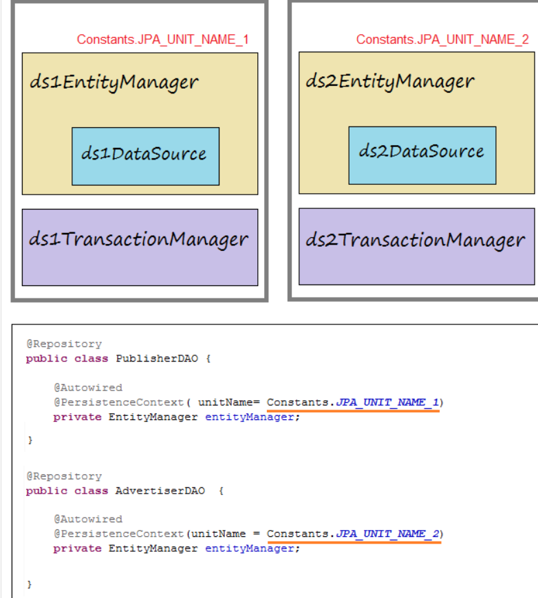

# Note about multiple data source

Su dung multiple data source khi trong mot ung dung ban muon su dung nhieu loai datasource khac nhau

Trong spring chung ta co:

- Routing DataSource: datasource chua danh sach cac datasource khac(phuc vu routing)

- Datasource intercepts se filter trang nao(endpoint) nao se su dung loai datasource nao.

# Config

Create file `datasource-cfg.properties` in resources folder

## For mysql

```
# ===============================
# DATASOURCE
# ===============================

# DataSource (PUBLISHER System).

spring.datasource.driver-class-name.1=com.mysql.jdbc.Driver
spring.datasource.url.1=jdbc:mysql://localhost:3306/publisher
spring.datasource.username.1=root
spring.datasource.password.1=12345


# DataSource (ADVERTISER System).

spring.datasource.driver-class-name.2=com.mysql.jdbc.Driver
spring.datasource.url.2=jdbc:mysql://localhost:3306/advertiser
spring.datasource.username.2=root
spring.datasource.password.2=12345


# ===============================
# JPA / HIBERNATE
# ===============================

spring.jpa.show-sql.1=true
spring.jpa.hibernate.ddl-auto.1=none
spring.jpa.properties.hibernate.dialect.1=org.hibernate.dialect.MySQLDialect
#spring.jpa.properties.hibernate.current_session_context_class.1=org.springframework.orm.hibernate5.SpringSessionContext


spring.jpa.show-sql.2=true
spring.jpa.hibernate.ddl-auto.2=none
spring.jpa.properties.hibernate.dialect.2=org.hibernate.dialect.MySQLDialect
#spring.jpa.properties.hibernate.current_session_context_class.2=org.springframework.orm.hibernate5.SpringSessionContext
```

## For sql(mssql)

```
# ===============================
# DATASOURCE
# ===============================


# DataSource  (PUBLISHER System).

spring.datasource.driver-class-name.1=com.microsoft.sqlserver.jdbc.SQLServerDriver
spring.datasource.url.1=jdbc:sqlserver://tran-vmware-pc\\SQLEXPRESS:1433;databaseName=publisher
spring.datasource.username.1=sa
spring.datasource.password.1=12345


# DataSource  (ADVERTISER System).

spring.datasource.driver-class-name.2=com.microsoft.sqlserver.jdbc.SQLServerDriver
spring.datasource.url.2=jdbc:sqlserver://tran-vmware-pc\\SQLEXPRESS:1433;databaseName=advertiser
spring.datasource.username.2=sa
spring.datasource.password.2=12345


# ===============================
# JPA / HIBERNATE
# ===============================

spring.jpa.show-sql.1=true
spring.jpa.hibernate.ddl-auto.1=none
spring.jpa.properties.hibernate.dialect.1=org.hibernate.dialect.SQLServerDialect
#spring.jpa.properties.hibernate.current_session_context_class.1=org.springframework.orm.hibernate5.SpringSessionContext


spring.jpa.show-sql.2=true
spring.jpa.hibernate.ddl-auto.2=none
spring.jpa.properties.hibernate.dialect.2=org.hibernate.dialect.SQLServerDialect
#spring.jpa.properties.hibernate.current_session_context_class.2=org.springframework.orm.hibernate5.SpringSessionContext
```

Mac dinh spring tu cau hinh datasource, can disable:

```
@EnableAutoConfiguration(exclude = { //
        DataSourceAutoConfiguration.class, //
        DataSourceTransactionManagerAutoConfiguration.class, //
        HibernateJpaAutoConfiguration.class })
```

Tiếp theo chúng ta sẽ cấu hình 2 DataSource:

1. Lớp DataSource1Config sử dụng để cấu hình cho datasource 1 (PUBLISHER DB).
2. Lớp DataSource2Config sử dụng để cấu hình cho datasource 2 (ADVERTISER DB).



Datasource config:

```
@Configuration
// Load to Environment
// (@see resources/datasource-cfg.properties).
@PropertySources({ @PropertySource("classpath:datasource-cfg.properties") })
public class DataSource1Config {

    @Autowired
    private Environment env; // Contains Properties Load by @PropertySources

    @Bean
    public DataSource ds1Datasource() {

        DriverManagerDataSource dataSource = new DriverManagerDataSource();
        dataSource.setDriverClassName(env.getProperty("spring.datasource.driver-class-name.1"));
        dataSource.setUrl(env.getProperty("spring.datasource.url.1"));
        dataSource.setUsername(env.getProperty("spring.datasource.username.1"));
        dataSource.setPassword(env.getProperty("spring.datasource.password.1"));

        return dataSource;
    }

    @Bean
    public LocalContainerEntityManagerFactoryBean ds1EntityManager() {
        LocalContainerEntityManagerFactoryBean em = new LocalContainerEntityManagerFactoryBean();
        em.setDataSource(ds1Datasource());

        // Scan Entities in Package:
        em.setPackagesToScan(new String[] { Constants.PACKAGE_ENTITIES_1 });
        em.setPersistenceUnitName(Constants.JPA_UNIT_NAME_1); // Important !!

        //
        HibernateJpaVendorAdapter vendorAdapter = new HibernateJpaVendorAdapter();

        em.setJpaVendorAdapter(vendorAdapter);

        HashMap<String, Object> properties = new HashMap<>();

        // JPA & Hibernate
        properties.put("hibernate.dialect", env.getProperty("spring.jpa.properties.hibernate.dialect.1"));
        properties.put("hibernate.show-sql", env.getProperty("spring.jpa.show-sql.1"));

        // Solved Error: PostGres createClob() is not yet implemented.
        // PostGres Only:
        // properties.put("hibernate.temp.use_jdbc_metadata_defaults",  false);

        em.setJpaPropertyMap(properties);
        em.afterPropertiesSet();
        return em;
    }

    @Bean
    public PlatformTransactionManager ds1TransactionManager() {

        JpaTransactionManager transactionManager = new JpaTransactionManager();
        transactionManager.setEntityManagerFactory(ds1EntityManager().getObject());
        return transactionManager;
    }
}
```

Constants:

```
public class Constants {
    
    public static final String PACKAGE_ENTITIES_1 = "org.o7planning.sbmultids.entity1";
    
    public static final String PACKAGE_ENTITIES_2 = "org.o7planning.sbmultids.entity2";
    
    public static final String JPA_UNIT_NAME_1 ="PERSITENCE_UNIT_NAME_1";
    public static final String JPA_UNIT_NAME_2 ="PERSITENCE_UNIT_NAME_2";   
}
```

De query data from dynamic datasource thi  su dung: 

```
@Autowired
@PersistenceContext(unitName = Constants.JPA_UNIT_NAME_2)
private EntityManager entityManager;
```


