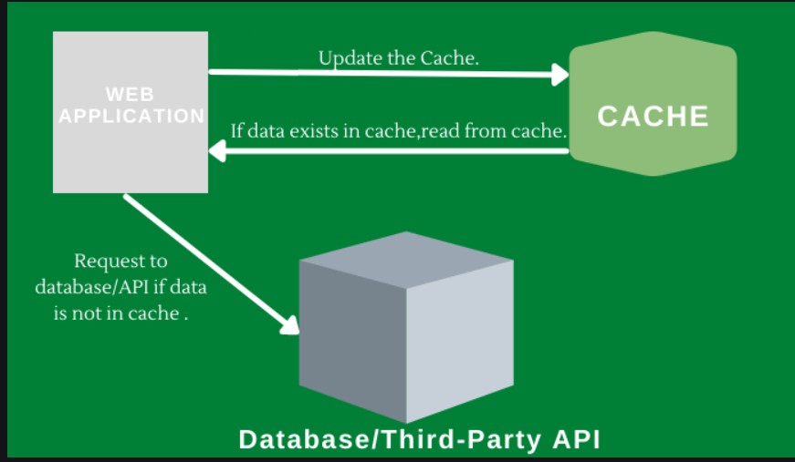

# Spring cache provider



A cache is any temporary storage location in memory, it lies between application and database => then to improve system => using cache for storing freequently data is accessed.

# Spring boot caching

Spring boot provides some annotation for caching behavior

## 1. @Cacheable

=> store method results in cache

```
 @Cacheable(value = "users", key = "#id")  // cache result with key = id
public User getUserById(Long id) {
    System.out.println("Fetching user from DB...");
    return userRepository.findById(id).orElseThrow();
}
```

## 2. @Cache Evict

=> Remove data from cache

```
@CacheEvict(value = "users", key = "#id")
public void deleteUser(Long id) {
    userRepository.deleteById(id);
}
```

## 3. @Cache Put

=> cache with new value, dont skip method(usually use when you want cache updated)

```
@CachePut(value = "users", key = "#user.id")
public User updateUser(User user) {
    return userRepository.save(user); // cache updated
}
```

## 4. @Caching

=> combine multiple caching annotations

```
@Caching(
    put = { @CachePut(value = "users", key = "#user.id") },
    evict = { @CacheEvict(value = "user_list", allEntries = true) }
)
public User saveUser(User user) {
    return userRepository.save(user);
}
```


## 5. @CacheConfig

=> Define cache name and config at level class

```
@Service
@CacheConfig(cacheNames = {"users"})
public class UserService {
    @Cacheable(key = "#id")
    public User getUser(Long id) { ... }
}
```


# Cache provider

Spring Cache is just an abstraction. Backends can be:

- Simple in-mem => default if you dont put cache provider
- Redis 

Config:

```
spring.cache.type=redis # or default
spring.data.redis.host=localhost
spring.data.redis.port=6379
```

# Conditional Caching

# Unless parameter

=> Using condition for caching if true then result will be cached

```
@Cacheable(value="name", unless="#result.length() < 20")
```

# Cache dependency

```
<dependency>  
     <groupId>org.springframework.boot</groupId>  
    <artifactId>spring-boot-starter-cache</artifactId>  
</dependency>
```