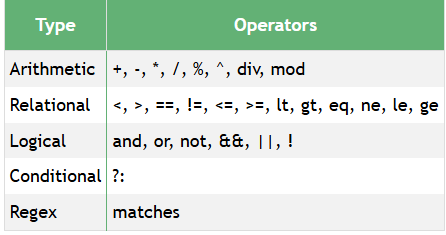

# Note about spring expression language

Spring expression language(SpEL) supports querying and manipulating an object at runtime and dynamically evaluate expressions in configuration, annotations, or code.

Operators avaiable:




# SpEL Syntax and Examples

Here are some common SpEL expressions and what they do:

## 1. Literal values

- @Value("#{5 + 10}")         // 15
- @Value("#{'Hello' + ' World'}")  // Hello World

# 2. Accessing properties

- @Value("#{person.name}")   // Access `name` property of a `person` bean
- @Value("#{systemProperties['os.name']}")  // Get OS name

# 3. Calling methods

- @Value("#{myBean.getUsername()}")  // Calls method on bean

# 4. Operators

- Arithmetic: +, -, *, /, %

- Logical: and, or, not

- Comparison: ==, <, >, <=, >=

@Value("#{5 > 2 ? 'yes' : 'no'}") // Ternary operator: "yes"

# 5. Collections

- @Value("#{myList[0]}")           // Get first element
- @Value("#{myMap['key']}")        // Access map by key
- @Value("#{myList.size()}")       // Call method on collection

# 6. Bean References

- @Value("#{someBean}")            // Inject the bean
- @Value("@someBean.doSomething()")  // Call method on bean


- The @ is used to refer to a bean by name.

# 7. SpEL in Security (@PreAuthorize etc.)

Example:

```
@PreAuthorize("hasRole('ADMIN')")              // Standard role check
@PreAuthorize("@authService.canEdit(#userId)") // Custom bean method check
```


In the second example:

- @authService → refers to a Spring bean named authService
- .canEdit(#userId) → method is called with method parameter userId

# Sumary

For @Value => you must write expression inside bracket {}

Example: call method from bean:

```
@Value("#{securityService.hasRole('admin')}")
private Boolean isTrue;
```

But when you use @PreAuthorize and @PostAuthorize of spring Security you dont need bracket:

```
//spring security have built some expression and you only use it
@PreAuthorize("hasRole('admin')")
public void createUser();
```

To custom your logic check authorize, call method from another bean

```
@PreAuthorize("@securityService.hasRole('admin')")
private Boolean isTrue;
```