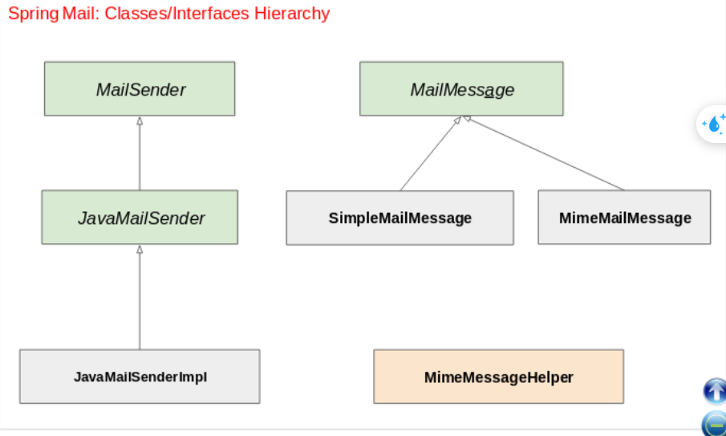
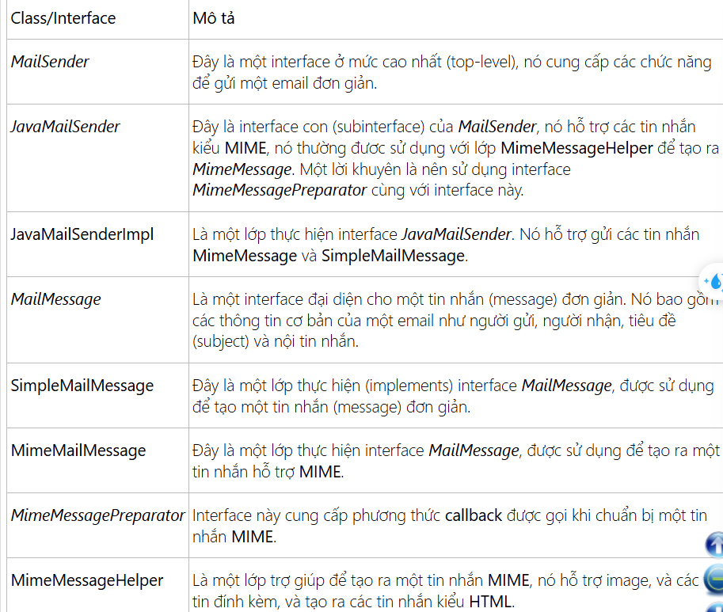

# Note gui mail voi spring

spring cung cap api de gui email la:

```
<dependency>
    <groupId>org.springframework.boot</groupId>
    <artifactId>spring-boot-starter-mail</artifactId>
</dependency>
```

# Cac class/interface



```
MIME => (phan mo rong gt internet mail) => gui cac kieu du lieu khac nhau(audio, image, video, dinh dang html)
```

## Details



