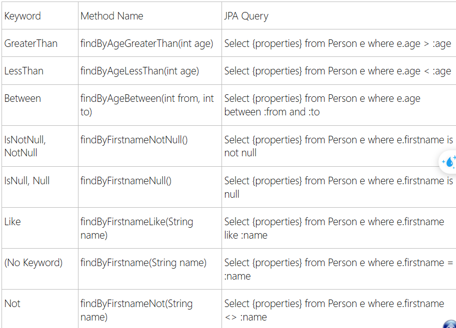

# Note projection

# Map single object

Truy van lay cac du lieu can thiet trong bang, nham lam tang hieu suat

Trong spring jpa, dung interface DTO voi cac thuoc tinh quan tam => phan con lai mapping se do jpa thuc hien

Ex:

```
public interface EmpView1 {
    int getId();
    String getFullName();
    int getAge();
}
```

Trong spring jpa, khi chi muon lay cac thuoc tinh can thiet de hien thi:

```
@Query("SELECT e.id as id,\n" +
            " concat(e.firstName,' ', e.lastName) as fullName \n" +
            "e.age as age FROM Employee e where e.id = :id")
List<EmpView1> findById(int id);
```


Trong interface EmpView1, co getFullName() ma trong Employee chi co firstName va lastName, de jpa co the map vao fullName chung ta su dung @Value:


```
@Value("#{target.firstName + ' ' + target.lastName}")
	public String getFullName();
```

Trong vi du tren su dung concat va dat ten no la `fullName` => khong can su dung @Value

Nhung voi truong hop nay thi can su dung @Value.

# Map nested

Lay du lieu tu Department:

```
public interface DeptView1 {
    int getId();
    String getDepartmentName();
}
```

=> attribute departmentName khong giong trong Department entity => can su dung @Value de map no lai

```
@Value("#{target.name}")
String getDepartmentName();
```

EmpView interface:

```
public interface EmpView3 {
    int getId();
    String getFullName();
    DeptView1 getDepartment();
}
```

`getDepartment()` phai giong trong truy van sql de jpa co the map:

```
@Query("""
        SELECT e.id as id,
        e.firstName as firstName,
        e.lastName as lastName,
        e.age as age,
        d as department
        FROM Employee e LEFT JOIN Department d on e.department.id = d.id
        """)
List<EmpView3> listEmployeeView3s();
```

# Quy uoc dat ten trong Repository

## Co tham so

```
"find" + "By" + "PropertyName"
"find" + "Xxx" + "By" + "PropertyName"
```

Query(method):

```
##
EmployeeView5 findEmployeeView5ByEmpNo(String empNo);

##
public EmployeeView6 findView6ByEmpNo(String empNo);
```

## Khong co tham so

```
"find" + "By"
"find" + "Xxx" + "By"
```

Query:

```
public List<EmployeeView6> findView6By();
```

## Tong hop

```
"find" + "By" + "PropertyNames" + "Keyword"
"find" + "Xxx" + "By" + "PropertyNames" + "Keyword"
```

# Cac keyword duoc su dung




# Dyamic projections

Khi co nhieu projections tuy vao logic => su dung Repository voi tham so class

```
public <T> List<T> findViewByEmpName(String empNo, Class<T> type);
```