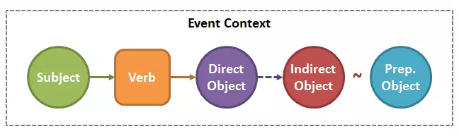
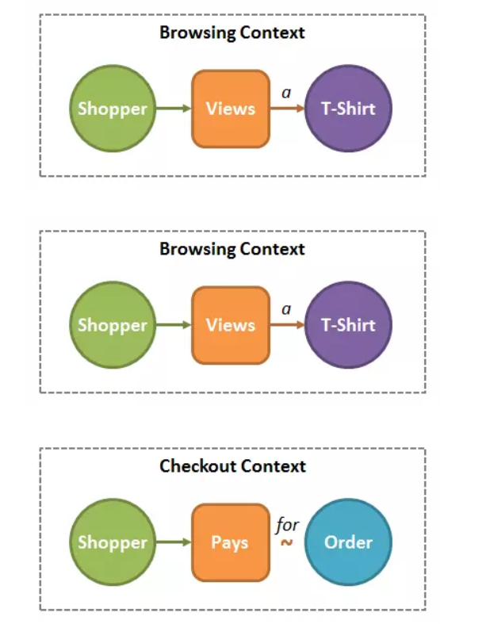
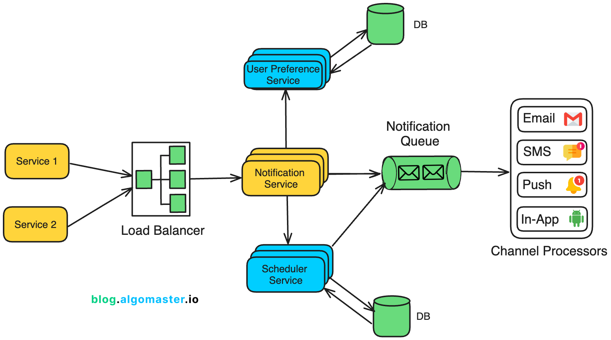
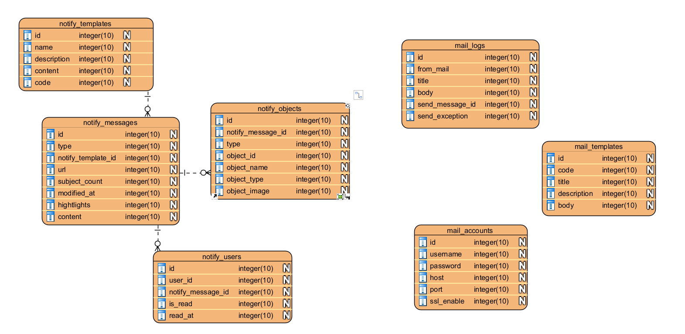

# Note about push notification

# Firebase cloud messaging
# 1. Firebase cloud messaging service

- Firebase cloud message is a free service of google to send push notification, data message to:
    - Androin, IOS
    - web(via worker service)
- Type of FCM:
    - Notification messages => show in trail(OS handle)
    - Data messages => app itself handle
# 2. Architecture

- App client (Android/iOS/Web) → đăng ký FCM và nhận device token.

- Backend server → gọi API FCM (HTTP v1 hoặc Admin SDK).

- FCM servers → phân phối tới thiết bị.

- User click → app bắt sự kiện và thông báo về backend.

# 3. Delivery

- App status:
    - Foreground => app receives via callback
    - Background => OS show it(notification message)
    - Terminated => OS show it, app open via tap event
- QoS => FCM do not ensure 100% immediately delivery but it is reliable

# 4. Quota & limit

- Per project:

    - 600k msg/minute.

    - Fanout (multicast/topic): 1,000 concurrent ops.

    - Topic subscription: 3k QPS.

- Per device:

    - 240 msg/minute.

    - 5k msg/hour.

- Payload:

    - 4096 bytes (API).

    - 1k chars (Firebase Console).

- Collapse Keys:

    - Tối đa 4 collapse keys/device.

- Token lifecycle:

    - Token inactive 270 ngày → auto delete.


# 5. Message type

- Notification messages:

```
{
  "message": {
    "token": "device_token",
    "notification": {
      "title": "Hello",
      "body": "World"
    }
  }
}
```

- Data messages

```
{
  "message": {
    "token": "device_token",
    "data": {
      "type": "chat",
      "id": "12345"
    }
  }
}
```

# 6. Targeting

- Single user(1 user)
- Multicast(batch) => maximum 500 tokens/request
- Topic:
    - Client subscribe => new, sports
    - Server send:
- Condition:
    - Boolean logic: "'news' in topics || 'sports' in topics"

# 7. Handle responses

Khi gửi multicast:

- BatchResponse.responses[i] ↔ token tương ứng.

- isSuccessful → log success/fail.

- Lỗi thường gặp:

    - messaging/invalid-argument

    - messaging/registration-token-not-registered

    - messaging/quota-exceeded

    - messaging/internal-error

# 8. Security

- Server Key (API key) → chỉ dùng ở backend.

- Client app → chỉ dùng FCM SDK, không giữ server key.

- Hỗ trợ:

    - HTTPS only.

    - Authentication bằng OAuth2 (HTTP v1 API).

- Tuân thủ: ISO 27001, SOC 1/2/3, GDPR, CCPA.

# 9. Best Practices

- Retry strategy:

    - Retry lỗi tạm thời (quota, internal).

    - Không retry token invalid → xóa khỏi DB.

- Queueing:

    - Dùng RabbitMQ/Kafka khi load lớn → điều phối request tới FCM.

- Analytics:

    - Firebase Analytics/BigQuery để đo CTR, open rate.

    - Opt-in/Opt-out:

    - Trên iOS cần xin quyền push.

    - Cho phép user tắt/bật notification.


# Zalo OA(Zalo official account) & Zalo notification Service

Zalo OA (Official Account) is the business/organization account on Zalo (Vietnam’s largest messaging platform). Through Zalo OA APIs and ZNS, developers can send notifications, transactional messages, and customer care alerts to users.

## 1. Message Types

Zalo provides several categories of messages:

- a) Consultation Messages

    - Used for customer support or responding to user requests.

    - Free quota: 8 messages per user within 48 hours of the last interaction.

    - After quota: Charged per message (~55 VND/message).

    - Recipient must have interacted with the OA.

- b) Transactional Messages

    - Used for order confirmations, OTPs, invoices, account alerts.

    - Must use approved templates.

    - Charged (~165 VND/message).

    - Sent to users who have followed the OA.

- c) Broadcast/Media Messages

    - Used for marketing, promotions, announcements.

    - Can send to all followers or targeted segments.

    - Free quota depends on OA type (content OA, service OA, etc).

    - Subject to anti-spam policies.

- d) ZNS (Zalo Notification Service)

    - High-priority system for sending messages directly to phone numbers (even if the user hasn’t followed your OA).

    - Requires pre-approved templates.

    - Can include text, images, logo, buttons (CTA: call, open website, pay, etc).

    - Charged (~200 VND/message + VAT).

    - Delivery only if the recipient phone number is linked to a Zalo account.


# Notification Grammar

## 1. Structure like english grammar



- Subject: Chủ thể gây ra hành động
- Verb: Động từ thể hiện hành động
- Direct Object: Đối tượng bị tác động chính của hành động
- Indirect Object: Đối tượng phụ bị ảnh hưởng bởi hành động
- Prepositional Object: Đối tượng có mặt trong hành động thông qua một giới từ (in, for, of,...). Kiểu 1 object có liên quan tới hành động thôi.
- Context: Hoàn cảnh xảy ra hành động, có thể bao gồm thông tin trả lời cho các câu hỏi: Where?, When?, How?




## Data for notification

- subjects: 1 list các chủ thể gây ra hành động
- subject_count: số lượng chủ thể. Field subjects sẽ không thể lưu hết toàn bộ số chủ thể của hành động (có thể lên tới hàng nghìn) mà chỉ lưu đại diện 1 số lượng nhất định. Do đó sẽ cần 1 field riêng để lưu số lượng chủ thể thật sự.
- di_object: Đối tượng bị tác động chính của hành động
- in_object: Đối tượng phụ bị ảnh hưởng bởi hành động
- pr_object: Đối tượng có mặt trong hành động thông qua một giới từ (in, for, of,...).

Mỗi loại object hay subject phía trên sẽ là 1 object có cấu trúc như sau:

- id: id của object
- name: tên của object. Đối với user thì là tên, đối với bài post hay comment thì là trích dẫn,...
- type: loại object
- image: ảnh đại diện cho object

## 3. Template engine(mustache)

```
{{ subjects[0].name }} đã thích bài viết của bạn.

~> Monmen đã thích bài viết của bạn.

{{ subjects[0].name }} đã bình luận vào bài viết trong {{ pr_object.name }}.

~> Monmen đã bình luận vào bài viết trong Group nhí nhố.

{{ subjects[0].name }} đã trả lời bình luận của {{ in_object.name }} trong {{ pr_object.name }}.

~> Monmen đã trả lời bình luận của Thỏ bảy màu trong Group nhí nhố
```

## 4. Gộp nhiều notification vào làm 1(khi có nhiều notification có nội dung giống nhau)

Tạo key(unique) cho mỗi notification, cho phép chúng nó thể ghi đè khi notification có context giống nhau

```
Ví dụ: đối với 1 user thì tất cả like dành cho 1 bài post phải được gộp vào với nhau chẳng hạn. Vậy thì key ở đây sẽ gồm có các yếu tố:

<type> + <post_id> + <user_id>
```

Sau khi có key và nhiều notification update thì lúc này template có thể được sửa như sau:

```
{{ subjects[0].name }}{{#if (gt subject_count 1) }} và {{ math subject_count '-' 1 }} người khác{{/if}} đã thích bài viết của bạn.

~> Monmen và 2 người khác đã thích bài viết của bạn.
```

## 5. Xử lý format

Để hightlight 1 phần của tin nhắn thì cần phải bôi đậm, tô màu:

```
{
	"body": {
		"delight_ranges": [],
		"image_ranges": [],
		"inline_style_ranges": [],
		"aggregated_ranges": [],
		"ranges": [
			{
				"entity": {
					"__typename": "User",
					"id": "xxx",
				},
				"entity_is_weak_reference": false,
				"length": 10,
				"offset": 0
			}
		],
		"color_ranges": [],
		"text": "Hồ Sỹ Nghi likes your photo: \"Mặc dù mình là người hay chém gió,...\""
	}
}
```

- Notification của facebook => sử dụng text cho nội dung và dùng ranges(decorators) đề trang trí cho từng phần của nội dung:
    - Ở ví dụ trên thì entity user => "Hồ Sỹ Nghi" => offset: 0(vị trí bắt đầu), length: 10(độ dài tối đa)


Xây dựng lại theo ví dụ:

```
{
    "content": "Monmen đã bình luận vào bài viết của Viblo",
    "highlights": [
        {
            "offset": 0,
            "length": 6
        },
        {
            "offset": 37,
            "length": 5
        }
    ]
}
```

## 6. Xử lý khi click vào notification

Thay vì ở phía client kiểm tra từng loại notification và tổ chức lại dữ liệu của mỗi loại notification thì ta sẽ xử lý dựa trên url luôn:
    - Khi học viên nộp bài => kèm theo url link bài tập đã nộp của học viên đó => giảng viên chỉ cần click notification => redirect tới url bài tập của học viên đó


# Notification architecture

A notification service is a system responsible for delivering timely and relevant information to users across various channels such as SMS, email, push notifications, and in-app messages.

## 1. Functional requirements

- Multi-channel Support: The system must support sending notifications through various channels including email, SMS, push notifications, and in-app messages.

- Multiple Notification Types: Support transactional (e.g., order confirmation), promotional (e.g., discount offers), and system-generated alerts (e.g., password reset).

- Scheduled Delivery: Support scheduling of notifications for future delivery(reminder).

- Rate Limiting: Ensure that users receive only a limited number of promotional messages in a given day to prevent spam.

- Retry Mechanism: Handle notification delivery failures, retrying when necessary (e.g., failed SMS or email).


## 2. Non-Functional Requirements

- Scalability: The system should handle millions of notifications per minute, supporting millions of concurrent users.

- High availability: Ensure minimal downtime so that notifications are delivered even in case of failures.

- Reliability: Guarantee at-least-once delivery of notifications, with the possibility of exactly-once semantics for certain use cases.

- Low latency: Notifications should be sent as quickly as possible to ensure timely delivery.


# 2. High level design




# Core entity

1. NotifyTemplate
    - Predefine message template to send to users
2. NotifyMessage
    - Store message which is sent to users
3. NotifyLog
    - Store logs for manipulation of NotifyMessage
4. EventDetection
    - Store event when notify is detected
5. MailAccount
6. MailTemplate 


# Core service

## 1. Executor service

Đây là các kênh để gửi thông báo tới người dùng cuối(qua email, firebase cloud message, zalo, sms)


Để có thể thêm các channel khác trong tương lai mà code không cần sửa lại và các channel khác, chức năng khác hoạt động ổn định thì cần thiết kế theo strategy pattern:

```
public enum ChannelType {
    WEB, EMAIL, SMS, MOBILE_PUSH, ZALO_OA;
}
public interface NotificationChannel <T>{
    void send(T t);
}
```

Khi thêm mới channel thì implmenets interface, mỗi channel sẽ xử lý logic ứng với nghiệp vụ của nó:

```
@Service
public class EmailChannel implements NotificationChannel<EmailNotification> {
    public void send(EmailNotification emN) {
        // logic gửi email
    }
}

@Service
public class FirebaseCloudMessageChannel implements NotificationChannel<FirebaseCloudMessageNotification> {
    public void send(FirebaseCloudMessageNotification fcmN) {
        // logic push realtime
    }
}
```

Khi gửi thông báo qua các kênh:

```
NotificationChannel channel = applicationContext.getBean(ChannelType.NAME);
channel.send(data);
```

Đối với mỗi kênh thì khi gửi thông báo trong cùng 1 lân request sẽ khác nhau:
- Firebase => 500 devices/request => nếu nhiều device thì chia nhỏ để nó không bị giới hạn
- Email => 1000 lần gửi /ngày => cần đảm bảo gửi không vượt quá tránh trường hợp bị ban


## 2. Scheduler service

Có nhiệm vụ tự động quét lịch học từng ngày vào lúc 0h và lên lịch tự động thông báo nhắc nhở lịch học, deadline.

- Sử dụng `@Scheduled`, `quartz job scheduler` lên lịch chạy từng ngày để quét dữ liệu

Ví dụ:

    ```
     // Runs every day at 12:00 PM
    @Scheduled(cron = "0 0 12 * * ?")
    public void runAtNoon() {
        // logic scan lessons, assignments(deadline)...
        // ???
        //nên quét từ core-service hay notification-service gọi api findAllLessons, findAllAsssignment 
        //tới core-service
        List<Lesson> lessons = core-service.findAllLessonByDate(...) 
        List<Assignment> assignments = core-service.findAllAssignmentByDate(...)
        
        //handle logic and schedule
    }
    ```

- Sử dụng `quartz job scheduler` để lên lịch đối với lịch học, dealine

Ví dụ:

```
Job: logic send notification
@Override
public void execute(JobExecutionContext context) throws JobExecutionException {
    // logic send notification here...
}
```

## 3. Storage service

Có nhiệm vụ lưu thông tin về thông báo, các lỗi liên quan, các loại thông báo, channel, email...

=> Làm thế nào để lưu trữ thông báo 1 cách hiệu quả khi thông báo có thể hightlight nội dung, redirect tới trang khác khi người dùng click vào thông báo, ....

Đối với thông báo email, push thì cách lưu trữ dữ liệu sẽ khác nhau





- NotifyTemplate => Mẫu thông báo cho push notification
- MailTemplate => Mẫu thông báo đối với mail
- MailLog => dùng để lưu lại thông báo đối với mail
- NotifyMessage => lưu thông báo tới người sử dụng:
    - url: 1 link đính kèm với thông báo, khi người dùng click sẽ sang trang khác
    - subject_count: khi có nhiều tin nhắn giống nhau được gửi từ nhiều người dùng tới 1 người dùng => sử dụng count và chỉ hiển thị tên người gửi thông báo phía trước
    - highlights: chuỗi json như sau: 

        ```
        [
            {
                offset: 0,
                length: 12
            },
            {
                offset: 20,
                length: 6
            }
        ]
        ```

        Trường này được sử dụng để làm nổi bật 1 vài phần của thông báo => người nhận sẽ nhìn thuận mắt hơn(như cảnh báo thì sẽ có một vài từ sẽ có màu đỏ)
    
- notify_objects: là các chủ thể, đối tượng tham gia vào việc tạo thông báo
    - type: SUBJECT, DI_OBJECT, IN_OBJECT, PR_OBJECT
        - SUBJECT => chủ thể gây ra hành động
        - DI_OBJECT => đối tượng chính bị ảnh ưởng bởi hành động của chủ thể 
        - IN_OBJECT => đối tượng bị ảnh hưởng phụ bởi hành động
        - PR_OBJECT => đối tượng có mặt trong hành động
        - Link <a href='https://viblo.asia/p/bi-thuat-xu-ly-ngu-phap-notification-nhu-facebook-m2vJPwxo4eK'>https://viblo.asia/p/bi-thuat-xu-ly-ngu-phap-notification-nhu-facebook-m2vJPwxo4eK</a>

    - object_type: liên quan đến người dùng, buổi học, bài tập(nói chung là các đối tượng cần được thông báo)
    - object_image: ảnh đại diện cho object
    - object_name: thường là tên của object như user thì họ tên, bài tập thì là tên bài tập, vv...


    - Thì lúc này giảng viên sẽ chỉ nhận được thông báo như sau:

        ```
        Nguyen Van A da nop bai tap X cua buoi hoc Y trong lop hoc Z
        Nguyen Van B da nop bai tap Y cua buoi hoc M trong lop hoc Z
        ```

        - SUBJECT => Nguyen Van A
        - DI_OBJECT => BAI TAP X
        - IN_OBJECT => LESSON Y
        - PR_OBJECT => CLASS Z

    - Khi có 4 thông giáo giống hệt nhau như đều là gửi bài tập X của buổi học Y trong lớp học Z, thay vì tạo mới message ta chỉ cần update count trong notify_message và cập nhật ai đã tạo và push lại cho giảng viên

    - => Thông báo giảng viên nhận được:
        
        ```
        Nguyen van D, Nguyen van C và 3 người khác đã nộp bài tập x của buổi y trong lop hoc z(học nguyen van d và 4 người khác)
        ```

        
# Preference

1. <a href='https://viblo.asia/p/xay-dung-he-thong-push-hang-trieu-notification-moi-gio-MkNLrkpaVgA'>https://viblo.asia/p/xay-dung-he-thong-push-hang-trieu-notification-moi-gio-MkNLrkpaVgA</a>

1. <a href='https://www.designgurus.io/course-play/grokking-system-design-interview-ii/doc/designing-a-notification-system'>https://www.designgurus.io/course-play/grokking-system-design-interview-ii/doc/designing-a-notification-system</a>
3. <a href='https://blog.algomaster.io/p/design-a-scalable-notification-service'>https://blog.algomaster.io/p/design-a-scalable-notification-service</a>

3. <a href='https://viblo.asia/p/bi-thuat-xu-ly-ngu-phap-notification-nhu-facebook-m2vJPwxo4eK'>https://viblo.asia/p/bi-thuat-xu-ly-ngu-phap-notification-nhu-facebook-m2vJPwxo4eK</a>