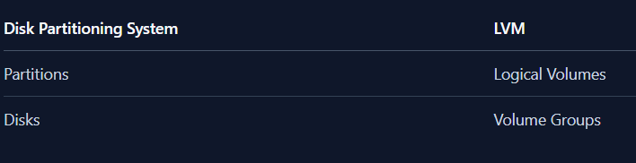

# What is LVM

LVM stands for Logical Volume Manage.

A mechanism that provides an alternative method of managin storage systems than the traditional partition-based one.

In LVM, instead of creating partitions, you create logical volumes and then you can just as easily mount those volumes in your filesystems as you'd a disk partition.

# Components of LVM

1. Physical Volumes
2. Volume groups
3. Logical volumes

# Why use LVM

The main advantage of LVM is how easy it is to `resize a LV or VG`

# 1. Physical volume

- The raw materials or building blocks that are used to achive the abstraction that is logical volumes. PV are the logical unit of LVM system.

- A physical volume can be anything, a raw disk, or a disk partition. Creating and initializing a physical volume are the same thing. Both mean you're just preparing the building blocks (i.e. partitions, disks) for further operations. This will become clearer in moment.

- Utilities: All utilities that manage physical volumes start with the letters pv for Physical Volume. E.g. pvcreate, pvchange, pvs, pvdisplay etc.