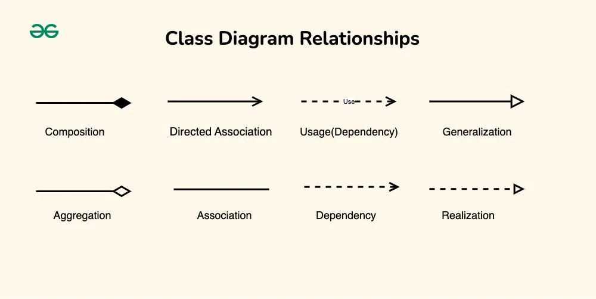

# UML class notation

Classes are depicted as boxes, each containing three compartments for the class name, attributes and methods.

## 1. Class name is written in the top compartment of the class box

## 2. Attributes also known as properties or fields are listed in the second compartment of the class box

## 3. Methods also know as functions or operations, represent the behavior or functionality of the class

## Visibility notation indicate the access level of attributes and methods:

    - + => public(visible to all classes)
    - - => private(only within class)
    - # => protected(visible to subclasses)
    - ~ => for package or default(visibl to classes in the same package)

# Relationship between classes

Relationship between classes describe how classes are connected or interacted with each other within a system.

## 1. Association
## 2. Directed association
## 3. Aggregation

Agg is a specialized form of association the represents a "whole-part" relationship.
It represented by a diamond shape on the side of the whole class. In this relationship the child can exist independenly of its parent class

## 4. Composition

It a stronger form of aggregation. The part cannot exist independently of the whole class. Composition is represented by a filled diamond shape on the side of the whole class.

## 5. Generalization(Inheritance)

Represents an "is-a" relationship between classes, where one class inherits the properties and behaviors of another class.

## 6. Realization(Inteface implementation)

Realization indicates that a class implements the features of an interface.

## 7. Dependency relationship

A dependency exists between two classes when one class relies on another, but the relationship is not as strong as assocation or inheritance. It represents a more loosely coupled connection between classes

