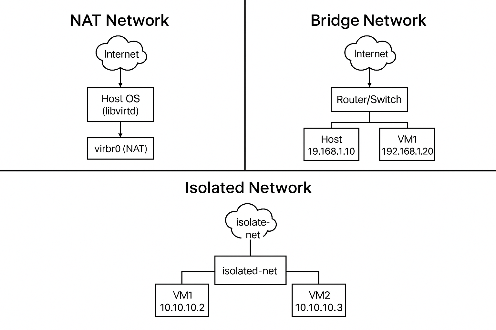

# Libvirt

Libvirt is an open-source virtualization management framework. It provides a consistent API, command-line tools, and GUI tools to create, manage, and monitor virtual machines (VMs) and other virtualization technologies.

# What can Libvirt do

- Start, stop, pause, and reboot VMs

- Create new VMs from ISO or cloud images

- Manage networks (NAT, bridged)

- Manage storage volumes and pools

- Create and manage VM snapshots

- Support live migration of VMs (advanced)

# Libvirt components

| Component      | Description                                            |
| -------------- | ------------------------------------------------------ |
| `libvirtd`     | The system daemon that manages VM lifecycle            |
| `virsh`        | Command-line tool to control VMs                       |
| `virt-manager` | GUI for desktop users to manage VMs (optional)         |
| Libvirt API    | Programming interface (C/C++, Python, Go, etc.)        |
| XML            | Used to define VM, storage, and network configurations |

# How libvirt works

Libvirt is not a hypervisor itself — it talks to hypervisors such as:

| Hypervisor | Description                                                 |
| ---------- | ----------------------------------------------------------- |
| **KVM**    | Kernel-based Virtual Machine (Linux) ✔️ Most common backend |
| **QEMU**   | Userspace emulator                                          |
| Xen        | Another hypervisor                                          |
| LXC        | Linux containers                                            |
| VMware     | Some limited support                                        |
| Hyper-V    | (via remote connection)                                     |

#  Tools to Use with Libvirt

| Tool           | Purpose                     |
| -------------- | --------------------------- |
| `virsh`        | CLI management              |
| `virt-manager` | Desktop GUI                 |
| `virt-install` | CLI VM creation             |
| `virt-viewer`  | Remote VM display           |
| `virt-top`     | Monitor VM CPU/memory usage |


# Libvirt Use Cases

- Run virtual machines on Linux like VMware/VirtualBox

- Automate VM creation on a server (e.g., cloud, labs)

- Build a virtualization dashboard

- Connect to and control remote hypervisors (SSH or TLS)


# Practice

## Ex1. Create virtual machine

Step by step

1. Install virtualization and cloud tools

```
sudo apt update
sudo apt install -y qemu-kvm libvirt-daemon-system libvirt-clients virtinst cloud-image-utils
```

These include:

```
qemu-kvm: Hypervisor

libvirt: Management layer

virtinst: For creating VMs (virt-install)

cloud-image-utils: Tools to generate cloud-init ISO
```

2. Dowload a cloud image

Use a minimal OS image, optimized for cloud/VM use.

### For Ubuntu 20.04:

```
mkdir -p ~/cloud-vms && cd ~/cloud-vms

wget https://cloud-images.ubuntu.com/focal/current/focal-server-cloudimg-amd64.img -O ubuntu-cloud.img
```

```Cloud images are typically in .qcow2 format and support cloud-init.```

To check what cloud your OS support, you can use this command:

```
sudo apt install libosinfo-bin #if your OS haven't installed yet
osinfo-query os
```

3. Create Cloud-Init Configuration Files

This tells the VM how to configure itself on first boot.

## A. Create cloud-init user-data:

```
mkdir -p seed-data
nano seed-data/user-data
```

Config

```
#cloud-config
hostname: cloudvm
users:
  - name: root
    shell: /bin/bash
    lock_passwd: false
    plain_text_passwd: '${ROOT_PASS}'
    sudo: ALL=(ALL) NOPASSWD:ALL

chpasswd:
  list: |
    root:${ROOT_PASS}
  expire: false

ssh_pwauth: true
disable_root: false

bootcmd:
  - echo "ttyS0" >> /etc/securetty

runcmd:
  - [ sed, -i, 's/^#\\?PasswordAuthentication.*/PasswordAuthentication yes/', /etc/ssh/sshd_config ]
  - [ sed, -i, 's/^#\\?PermitRootLogin.*/PermitRootLogin yes/', /etc/ssh/sshd_config ]
  - [ sed, -i, 's/^#\\?ChallengeResponseAuthentication.*/ChallengeResponseAuthentication no/', /etc/ssh/sshd_config ]
  - [ sed, -i, 's/^#\\?UsePAM.*/UsePAM yes/', /etc/ssh/sshd_config ]
  - [ systemctl, restart, ssh ]
```

```Or remove ssh-authorized-keys if using password only.```

## B. Create cloud-init meta-data:

```
nano seed-data/meta-data
```

```
instance-id: cloudvm
local-hostname: cloudvm
```

4. Generate the Cloud-Init ISO

This ISO is attached as a virtual CD-ROM to pass the config.

```
cloud-localds seed.iso seed-data/user-data seed-data/meta-data
```

You will get a seed.iso file

5. Prepare the Disk Image

Copy the base cloud image and (optionally) resize it:

```
cp ubuntu-cloud.img ubuntu-cloud-vm.qcow2
qemu-img resize ubuntu-cloud-vm.qcow2 +10G   # optional
```

6. Create and Launch the VM with Libvirt

```
sudo mv ~/cloud-vms/ubuntu-cloud-vm.qcow2 /var/lib/libvirt/images/
sudo mv ~/cloud-vms/seed.iso /var/lib/libvirt/images/

virt-install \
  --name cloud-vm \
  --memory 2048 \
  --vcpus 2 \
  --disk path=/var/lib/libvirt/images/ubuntu-cloud-vm.qcow2,format=qcow2 \
  --disk path=/var/lib/libvirt/images/seed.iso,device=cdrom \
  --os-variant ubuntu20.04 \
  --import \
  --network network=nat-net \
  --graphics none \
  --noautoconsole
```

- Explanation:

    - --import: Boot from an existing disk (no ISO install)

    - --disk: First is root disk, second is cloud-init ISO

    - --network=default: Use Libvirt NAT network

    - --graphics none: No GUI; use SSH or virsh console

7. Access the Virtual Machine

## Option A: Check IP with virsh

```
virsh domifaddr cloud-vm
```

## Option B: SSH into the VM

```
ssh ubuntu@<vm-ip>
# or login using password 'ubuntu' if not using SSH keys
```

## Ex2. Delete VM

To delete VM we will use this command:

1.  Undefine (delete VM metadata)

This removes the VM definition from Libvirt.

```
virsh undefine <vm-name>
```

2. Delete the VM disk(s) (optional but usually desired)

If your VM used disks in /var/lib/libvirt/images/, delete them:

```
sudo rm /var/lib/libvirt/images/cloud-vm.qcow2
sudo rm /var/lib/libvirt/images/seed.iso
```

3. (Optional) If the VM is running, stop it first:

```
virsh destroy <vm-name>
```

Combineed

```
virsh destroy cloud-vm
virsh undefine cloud-vm
sudo rm /var/lib/libvirt/images/ubuntu-cloud-vm.qcow2
sudo rm /var/lib/libvirt/images/seed.iso
```


## Ex3. Create VM using Public/Private key for authenticate

1. Generate SSH Key (if you don’t have one)

On your local machine run this command:

```
ssh-keygen -t rsa -b 4096 -C "your_email@example.com"
```

Press Enter to accept the default location ```(~/.ssh/id_rsa)```.

You will get:

- Public key: ```~/.ssh/id_rsa.pub```

- Private key: ```~/.ssh/id_rsa (keep this safe!)```

2. Create user-data with public key

```
#cloud-config
hostname: cloudvm

users:
  - name: root
    shell: /bin/bash
    lock_passwd: true
    sudo: ALL=(ALL) NOPASSWD:ALL
    ssh-authorized-keys:
      - ssh-rsa AAA..your_public_key...

chpasswd:
  expire: false

ssh_pwauth: false
disable_root: false

bootcmd:
  - echo "ttyS0" >> /etc/securetty
  - sed -i 's/^#\?PasswordAuthentication.*/PasswordAuthentication no/' /etc/ssh/sshd_config
  - sed -i 's/^#\?PermitRootLogin.*/PermitRootLogin yes/' /etc/ssh/sshd_config
  - sed -i 's/^#\?ChallengeResponseAuthentication.*/ChallengeResponseAuthentication no/' /etc/ssh/sshd_config
  - sed -i 's/^#\?UsePAM.*/UsePAM yes/' /etc/ssh/sshd_config

runcmd:
  - [ systemctl, restart, ssh ]

```

3. Launch the VM

4. SSH into the VM using your private key

```
ssh -i ~/.ssh/id_rsa ubuntu@<vm-ip>
```


# Virsh Network Management

A libvirt network is a virtual switch (bridge or NAT) that connects VMs to each other, and optionally to the outside world.

Libvirt using linux command for create virtual switch and they will manage that switch for attach to VM

## Terminology

- virbrX → Virtual bridge created by libvirt (NAT/Isolated)

- vnetX → Virtual NIC for VM

- tapX / vethX → TAP interfaces for containers or VMs

- brX → Linux bridges created manually or by NetworkManager

## Common network types:

- nat: VMs can reach the internet via NAT (default: virbr0)

- bridge: VMs connect to a real interface (like eth0)

- isolated: VMs only talk to each other



## View All Networks

```
virsh net-list --all
```

## Start / Stop / Autostart a Network

```
# Start a network
virsh net-start default

# Stop a network
virsh net-destroy default

# Enable autostart on boot
virsh net-autostart default

# Disable autostart
virsh net-autostart --disable default
```

## Create a Nat Network 

1. Create an XML definition file ```my-net.xml```:

```
<network>
  <name>my-net</name>
  <bridge name="virbr1" />
  <forward mode="nat"/>
  <ip address="192.168.100.1" netmask="255.255.255.0">
    <dhcp>
      <range start="192.168.100.100" end="192.168.100.200" />
    </dhcp>
  </ip>
</network>
```

2. Define and start it:

```
virsh net-define my-net.xml
virsh net-start my-net
virsh net-autostart my-net
```


## Create a Isolated Network 

```
<network>
  <name>isolated-net</name>
  <bridge name="virbr20" stp="on" delay="0"/>
  <ip address="10.10.10.1" netmask="255.255.255.0">
    <dhcp>
      <range start="10.10.10.10" end="10.10.10.50"/>
    </dhcp>
  </ip>
</network>
```