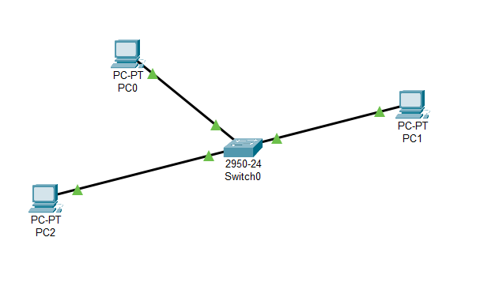
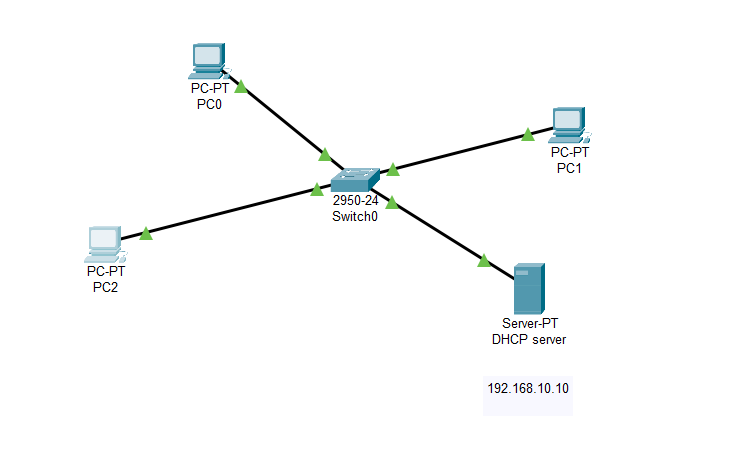

# Note about practice

# Ex1. Build network topology like this image



- Subnet: 192.168.10.0/24

- Using ovs acts as switch

- Using netns acts as PC:
    - PC0 -> ns0 => 192.168.10.1
    - PC1 -> ns2 => 192.168.10.2
    - PC2 -> ns3 => 192.168.10.3

Code:

```
sudo ovs-vsctl add-br ex0 # create new bridge(switch)

## simulation for PC
sudo ip netns add ns0 # PC0
sudo ip netns add ns1 # PC1
sudo ip netns add ns2 # PC2 

## Create link(cab) for connecting from PC to Switch

sudo ip link add veth0-ns0 type veth peer name ovs-ns0

sudo ip link add veth0-ns1 type veth peer name ovs-ns1

sudo ip link add veth0-ns2 type veth peer name ovs-ns2

# Connect PC to Switch

## connect between switch and ns0(PC0)
sudo ovs-vsctl add-port ex0 ovs-ns0
sudo ip link set veth0-ns0 netns ns0

sudo ovs-vsctl add-port ex0 ovs-ns1
sudo ip link set veth0-ns1 netns ns1

sudo ovs-vsctl add-port ex0 ovs-ns2
sudo ip link set veth0-ns2 netns ns2


# Enable port

sudo ip link set ovs-ns0 up
sudo ip link set ovs-ns1 up
sudo ip link set ovs-ns2 up

sudo ip netns exec ns0 ip link set veth0-ns0 up
sudo ip netns exec ns1 ip link set veth0-ns1 up
sudo ip netns exec ns2 ip link set veth0-ns2 up


# Assign ip address

sudo ip netns exec ns0 ip address add 192.168.10.1/24 dev veth0-ns0

sudo ip netns exec ns1 ip address add 192.168.10.2/24 dev veth0-ns1

sudo ip netns exec ns2 ip address add 192.168.10.3/24 dev veth0-ns2


# We have done, test communication between PC0 and PC2

sudo ip netns exec ns0 ping 192.168.10.3
```

`Result`: 

```
PING 192.168.10.3 (192.168.10.3) 56(84) bytes of data.
64 bytes from 192.168.10.3: icmp_seq=1 ttl=64 time=0.542 ms
64 bytes from 192.168.10.3: icmp_seq=2 ttl=64 time=0.072 ms
64 bytes from 192.168.10.3: icmp_seq=3 ttl=64 time=0.051 ms
64 bytes from 192.168.10.3: icmp_seq=4 ttl=64 time=0.062 ms
64 bytes from 192.168.10.3: icmp_seq=5 ttl=64 time=0.076 ms
64 bytes from 192.168.10.3: icmp_seq=6 ttl=64 time=0.075 ms
64 bytes from 192.168.10.3: icmp_seq=7 ttl=64 time=0.070 ms
64 bytes from 192.168.10.3: icmp_seq=8 ttl=64 time=0.049 ms
64 bytes from 192.168.10.3: icmp_seq=9 ttl=64 time=0.071 ms
^C
--- 192.168.10.3 ping statistics ---
9 packets transmitted, 9 received, 0% packet loss, time 8174ms
rtt min/avg/max/mdev = 0.049/0.118/0.542/0.150 ms
```

# Ex2. Like Ex1 but i want to use DHCP server for automation assign ip to PC




I will use toponogy in above, and add new DHCP server.

I will use `dnsmasq` for creating dhcp server, before move on i will give some detail about it

`dnsmasq` is a lightweight DNS forwarder and DHCP server designed for small networks. It's ideal for:

- Embedded systems

- Virtual environments

- Simulated networks (like netns)

- It supports:

- DHCP (IPv4 and IPv6)

- TFTP (PXE booting)

- DNS caching and forwarding

- Static leases

- DHCP options

## Key Features Used for DHCP

| Feature                    | Purpose                                         |
| -------------------------- | ----------------------------------------------- |
| `interface=`               | Specify which interface to listen on            |
| `bind-interfaces`          | Prevent binding all interfaces (isolate to one) |
| `dhcp-range=`              | Define a pool of IP addresses to lease          |
| `dhcp-host=`               | Assign static IPs by MAC                        |
| `dhcp-option=`             | Provide gateway, DNS, NTP, etc.                 |
| `log-queries` / `log-dhcp` | Debugging and monitoring                        |
| `no-daemon`                | Run in foreground (for debugging in `netns`)    |


To config dhcp properties we will edit in file: `/tmp/dnsmasq-ns/dnsmasq.conf`

```
# Only listen on this interface
interface=veth-server

# Don’t bind to all interfaces (important in namespace)
bind-interfaces

# Enable DHCP with a pool
dhcp-range=10.10.10.100,10.10.10.150,12h

# (Optional) Set gateway (router) for clients
dhcp-option=3,10.10.10.1

# (Optional) Set DNS server (can be external)
dhcp-option=6,8.8.8.8

# (Optional) Static lease (MAC, IP)
# dhcp-host=AA:BB:CC:DD:EE:FF,10.10.10.200

# (Optional) Log DHCP actions
log-dhcp

# Keep it in foreground (for debugging)
no-daemon
```

### Insatll dnsmasq

```
sudo apt install dnsmasq
```

```
ip netns add server-ns # create server dns
ip link add veth-server type veth peer name veth-client # create link

ip link add veth-server type veth peer name veth-server-br # create link to connect server with switch

ip link set veth-server netns server-ns # connect to server
ovs-vsctl add-port ex0 veth-server-br # connect to switch

# Enable link
ip link set veth-server-br up


# Config Ip for server
ip netns exec server-ns ip addr add 192.168.10.10/24 dev veth-server
ip netns exec server-ns ip link set dev lo up
ip netns exec server-ns ip link set dev veth-server up
```

###  Configure dnsmasq in server-ns

Create config:

```
mkdir -p /tmp/dnsmasq-ns
cat <<EOF > /tmp/dnsmasq-ns/dnsmasq.conf
interface=veth-server
bind-interfaces
dhcp-range=192.168.10.50,192.168.10.100,12h
dhcp-option=3,192.168.10.1
dhcp-option=6,8.8.8.8
log-dhcp
no-daemon
EOF
```

### Run dnsmasq inside server-ns:

```
ip netns exec server-ns dnsmasq --conf-file=/tmp/dnsmasq-ns/dnsmasq.conf
```

##  Run DHCP client in client-ns

```
ip netns exec client-ns dhclient veth0-ns0
```


## Test

```
ip netns exec ns1 ping 192.168.10.10
```

#