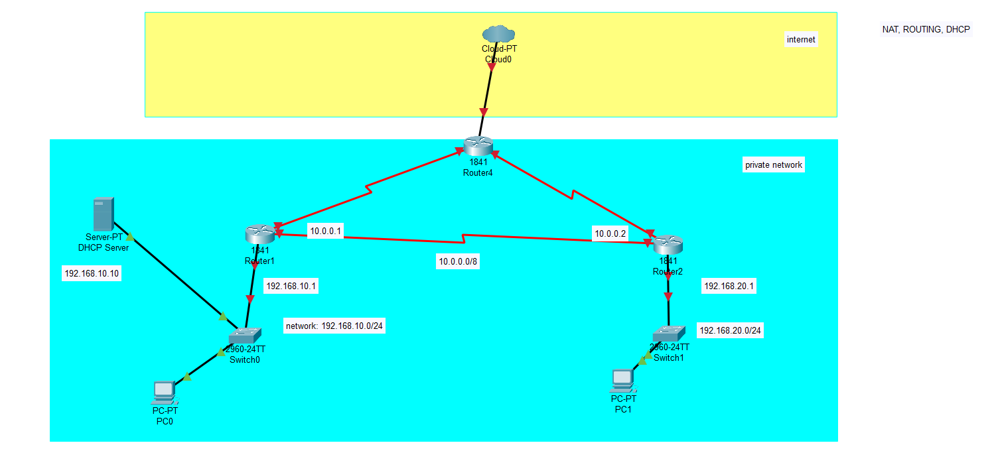

# Practice2

# Ex1: Build network like this image



In linux i will use netns for simulation PC and router, for router has IP access to internet is linux host.

Define netns:

- DHCP Server => dhcp
- PC0 => pc0
- S0 => br0
- S1 => br1
- PC1 => pc1
- router1 => r1
- router2 => r2

Command: 

```
sudo ip netns add dhcp
sudo ip netns add pc0
sudo ip netns add pc1
sudo ip netns add r1
sudo ip netns add r2
sudo ovs-vsctl add-br br0
sudo ovs-vsctl add-br br1
```

Link cable

```
#for dhcp
sudo ip link add veth-dhcp type veth peer name br0-dhcp
sudo ip link set veth-dhcp netns dhcp
sudo ovs-vsctl add-port br0 br0-dhcp
sudo ip link set br0-dhcp up
sudo ip netns exec dhcp ip link set veth-dhcp up

#for pc0
sudo ip link add veth-pc0 type veth peer name br0-pc0
sudo ip link set veth-pc0 netns pc0
sudo ovs-vsctl add-port br0 br0-pc0
sudo ip link set br0-pc0 up
sudo ip netns exec pc0 ip link set veth-pc0 up

#for r1
sudo ip link add veth-r1 type veth peer name br0-r1
sudo ip link set veth-r1 netns r1
sudo ovs-vsctl add-port br0 br0-r1
sudo ip link set br0-r1 up
sudo ip netns exec r1 ip link set veth-r1 up


#for pc1
sudo ip link add veth-pc1 type veth peer name br1-pc1
sudo ip link set veth-pc1 netns pc1
sudo ovs-vsctl add-port br1 br1-pc1
sudo ip link set br1-pc1 up
sudo ip netns exec pc1 ip link set veth-pc1 up

#for r2
sudo ip link add veth-r2 type veth peer name br1-r2
sudo ip link set veth-r2 netns r2
sudo ovs-vsctl add-port br1 br1-r2
sudo ip link set br1-r2 up
sudo ip netns exec r2 ip link set veth-r2 up


#for r1 and r2
sudo ip link add veth-r-r1 type veth peer name veth-r-r2
sudo ip link set veth-r-r1 netns r1
sudo ip link set veth-r-r2 netns r2
sudo ip netns exec r1 ip link set veth-r-r1 up
sudo ip netns exec r2 ip link set veth-r-r2 up

#Assign ip for dhcp server and router
sudo ip netns exec dhcp ip address add 192.168.10.10/24 dev veth-dhcp
sudo ip netns exec r1 ip address add 192.168.10.1/24 dev veth-r1
sudo ip netns exec r1 ip address add 10.0.0.1/8 dev veth-r-r1
sudo ip netns exec r2 ip address add 192.168.20.1/24 dev veth-r2
sudo ip netns exec r2 ip address add 10.0.0.2/8 dev veth-r-r2

```

## Config dhcp server

```
mkdir -p /tmp/dnsmasq-practice2
cat <<EOF > /tmp/dnsmasq-practice2/dnsmasq.conf
interface=veth-dhcp
bind-interfaces
no-daemon
log-dhcp

dhcp-range=192.168.10.50,192.168.10.100,255.255.255.0,12h
dhcp-option=option:router,192.168.10.1
dhcp-option=option:dns-server,8.8.8.8

dhcp-range=192.168.20.50,192.168.20.100,255.255.255.0,12h
dhcp-option=option:router,192.168.20.1
dhcp-option=option:dns-server,8.8.8.8
EOF
```


# Run dhcp service in dhcp server

```
sudo ip netns exec dhcp dnsmasq --conf-file=/tmp/dnsmasq-practice2/dnsmasq.conf
```

# For device which in the same subnet with dhcp then using

```
#PC0
sudo ip netns exec pc0 dhclient veth-pc0
```

# For device which in different subnet we must routing them.


```
sudo ip netns exec dhcp ip route add default via 192.168.10.1
sudo ip netns exec r1 ip route add 192.168.20.0/24 via 10.0.0.2
sudo ip netns exec r2 ip route add 192.168.10.0/24 via 10.0.0.1
```

# After routing we using dhcp relay agent for pc where server is located

```
#in router2
sudo ip netns exec r2 dhcrelay  192.168.10.10

#in pc1
sudo ip netns exec pc1 dhclient veth-pc1
```